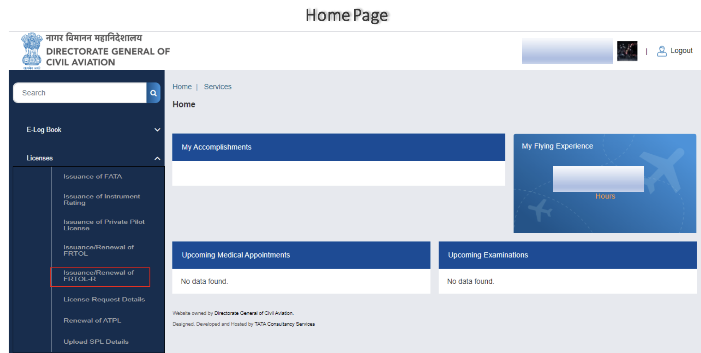
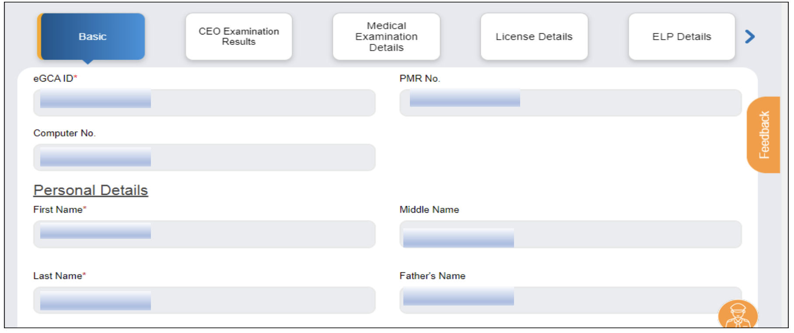
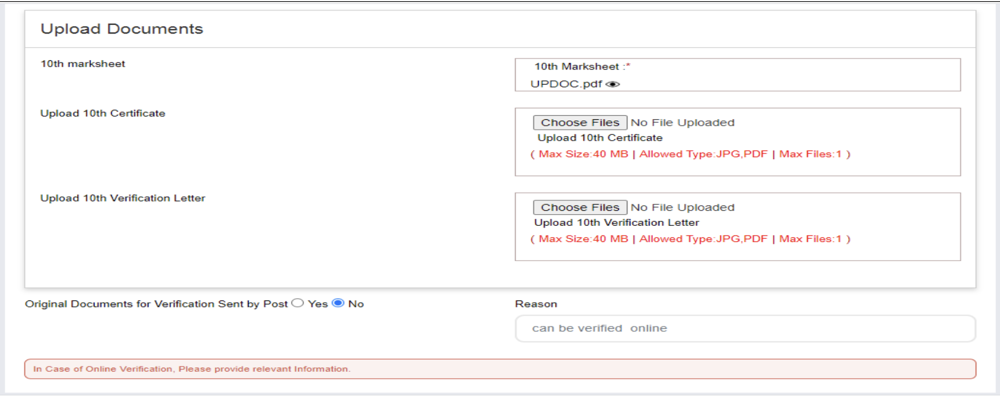
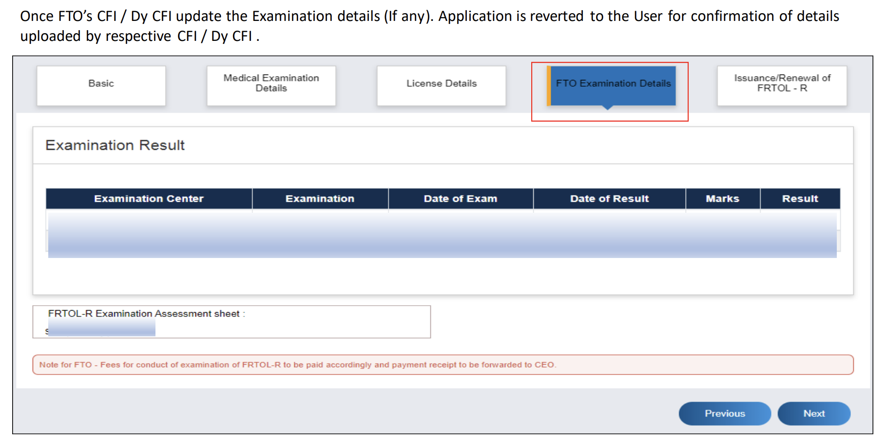

# Application of FRTOL (Flight Radio Telephone Operator's License)

*Writer: Wingman Log | August 3, 2023 | 4 min read*

In the vast and dynamic world of aviation, communication plays a pivotal role in ensuring safe and efficient flights. Pilots and flight operators rely on advanced radio systems to stay connected with air traffic control, fellow aviators, and ground personnel. To regulate this crucial aspect of aviation, the issuance of a Flight Radio Telephone Operator License - Restricted (FRTOL-R) is of utmost importance. In this comprehensive guide, we'll take you through the step-by-step process of obtaining this license and shedding light on the prerequisites, procedures, and essential details you need to know.

## Prerequisites for FRTOL-R Issuance

Before you embark on the journey of obtaining your Flight Radio Telephone Operator License - Restricted (FRTOL-R), there are several prerequisites that you must meet. These prerequisites are carefully designed to ensure that you have the necessary skills, qualifications, and knowledge to operate flight radio communication equipment effectively.

1.  eGCA Registration: The first step towards obtaining an FRTOL-R is to register on the eGCA portal and acquire a unique eGCA ID. This portal serves as the digital gateway for aviation-related services and processes.
    
2.  Medical Assessment: Your physical well-being is of paramount importance in aviation. A valid Class I/II medical assessment, in accordance with Rule 39 C of The Aircraft Rules, 1937, is mandatory.
    
3.  Educational Qualification: Meeting the educational standards outlined in Para 1 (b) of Section Z, Schedule II, The Aircraft Rules, 1937, is essential.
    
4.  Pilot License: To be eligible for an FRTOL-R, you must hold a valid Student Pilot License (SPL), Private Pilot’s License, or Pilot’s License.
    
5.  Flight Radio Telephone Operator's License Exam: Successfully completing the FRTOL-R examination conducted by an approved Flight Training Organization (FTO) is a vital requirement.

## Step-by-Step Process

Now that we have a clear understanding of the prerequisites, let's delve into the step-by-step process of obtaining your FRTOL-R:

### Step 1: eGCA Portal Login

*   Access the eGCA portal using your unique eGCA ID and password.

### Step 2: Select "Issuance/Renewal of FRTOL-R"

*   Navigate to the "Services" section on the left side panel and choose "Issuance/Renewal of FRTOL-R."

### Step 3: Read and Understand Instructions

*   Before proceeding, carefully read and comprehend the instructions and user manual provided.

### Step 4: Verify and Fill Application Form

*   Verify your basic details, examination details, medical examination details, and license details.

*   Provide accurate information about your PMR No., Computer No., Personal Details, Contact Details, and Address Details.
    
*   If required, submit educational verification documents.

### Step 5: Address Discrepancies

*   If any discrepancies are found, rectify them through the appropriate channels.

### Step 6: Validate Details and Submit

*   Validate all populated details in the form and complete the remaining sections.
    
*   Upon submission, the application will be directed to the Bharatkosh payment gateway.

### Step 7: Application Submission

*   For issuance of FRTOL-R, select the desired Flight Training Organization (FTO) from the available options.
    
*   After submitting the application, the status will show as "Pending with FTO."

### Step 8: Track Application

*   Monitor the progress of your application by selecting "License Request Details" from the left side panel.

### Step 9: Payment Completion

*   Once the payment is successfully processed, a payment receipt will be generated.

In the realm of aviation, effective communication is the backbone of safe and successful flights. Acquiring a Flight Radio Telephone Operator License - Restricted (FRTOL-R) is a crucial step towards becoming a responsible and skilled aviator. By following the step-by-step process outlined in this guide, you'll be well on your way to obtaining your FRTOL-R and contributing to the seamless flow of communication in the skies. Remember, every detail matters, and your dedication to meeting the prerequisites and completing the application process accurately will set you on a path to aviation excellence. So, spread your wings, master the airwaves, and embark on a journey that will elevate your aviation career to new heights. For more information, please review this pdf.

Issuance or Renewal of FRTOL-R.pdf

Download PDF • 1.96MB
