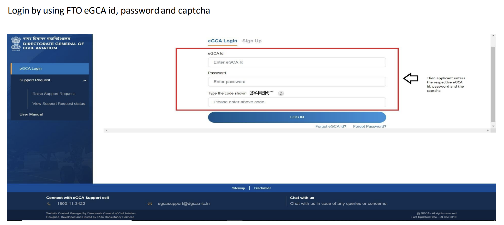
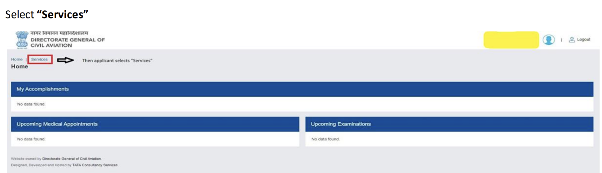
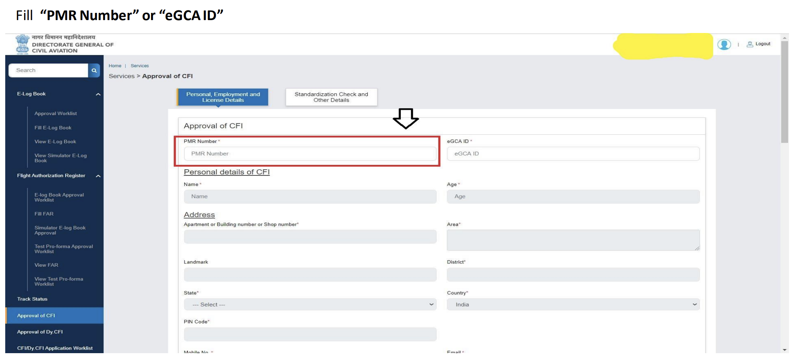
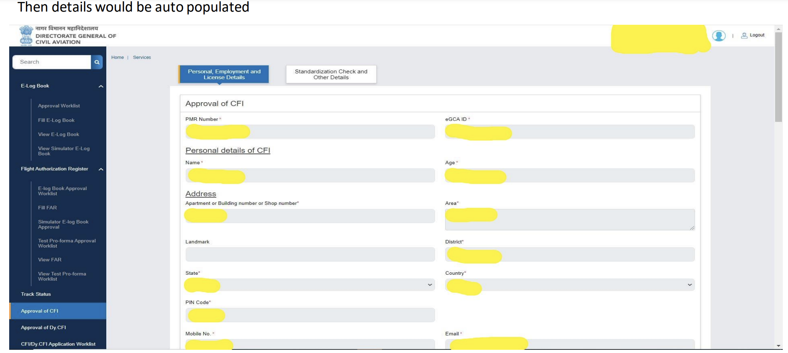
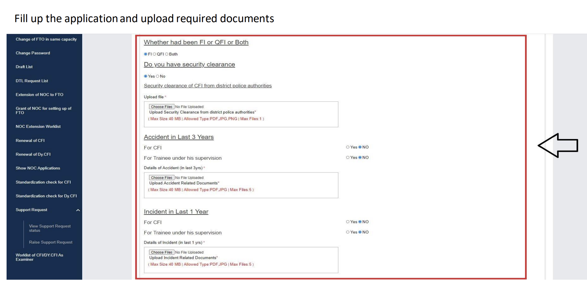
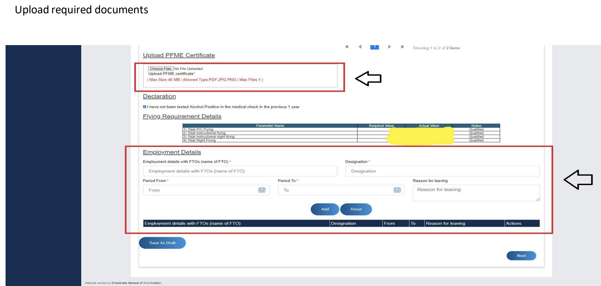
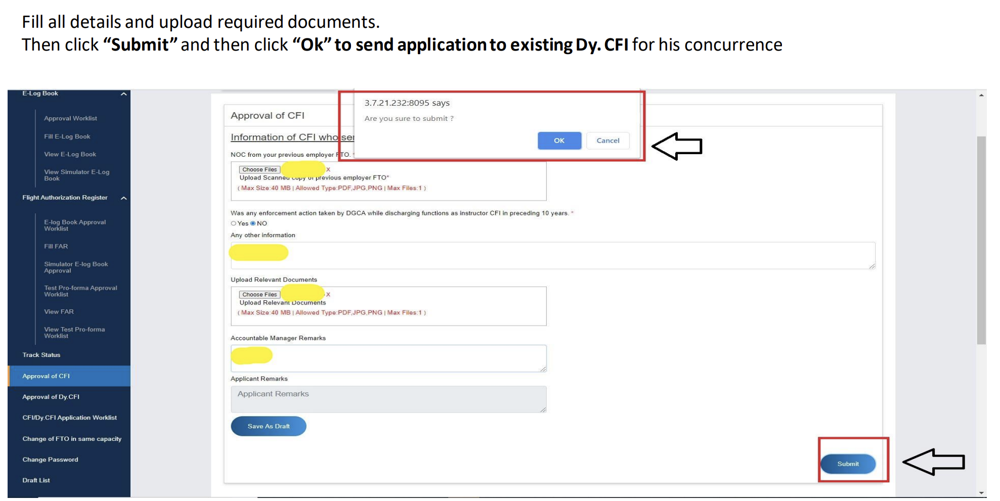

# CFI Approval on eGCA or CFI Application on eGCA

*Writer: Wingman Log | August 30, 2023 | 3 min read*

The aviation industry is a realm of precision and expertise, where the roles of Chief Flight Instructors (CFIs) hold paramount importance. Ensuring that these instructors meet the necessary qualifications and requirements is an essential step in maintaining aviation standards. This blog delves into the streamlined process of approving Chief Flight Instructors through the eGovernance of Civil Aviation (eGCA) platform, highlighting the steps from application submission to final approval.

## FTO and Dy.CFI Pre-requisites

Before delving into the application process, it's important to note the prerequisites for both the Flight Training Organization (FTO) and the Deputy Chief Flight Instructor (Dy.CFI):

1.  **Existing Dy. CFI**: The candidate must hold the position of Deputy Chief Flight Instructor.
    
2.  **FTO and Dy. CFI Registration**: Both the FTO and Dy.CFI must already be registered on the eGCA external portal with valid eGCA IDs.
    
3.  **Valid Contact Information**: Valid email IDs and mobile numbers for both the FTO and Dy.CFI are crucial.
    
4.  **Access to DGCA Website**: Access to the Directorate General of Civil Aviation (DGCA) website is essential for submitting and processing applications.

## Step-by-Step Approval Process

### Step 1: Access eGCA Portal

Begin by visiting the official DGCA website ([www.dgca.gov.in](http://www.dgca.gov.in/)) and select the "eGCA Login" option.

### Step 2: Log in Using FTO eGCA ID

Log in using the eGCA ID, password, and captcha associated with the FTO's account.

### Step 3: Navigate to "Services"

After successful login, select the "Services" tab, followed by "Approval of CFI" service.

### Step 4: Fill PMR Number or eGCA ID

Provide the PMR Number or eGCA ID to auto-populate the necessary details.

### Step 5: Complete Application and Document Upload

Fill out the application form with the required information. Upload the necessary documents as specified.

### Step 6: Document Upload

Upload the requisite documents as per the instructions provided.

### Step 7: Complete Application and Send to Dy. CFI

Fill in all the required details, attach necessary documents, and click "Submit." Upon submission, confirm by clicking "Ok" to send the application to the existing Dy. CFI for concurrence.

### Step 8: Dy. CFI Review and Approval

The application is forwarded to the Dy. CFI for review and approval. The Dy. CFI logs into the eGCA portal, navigates to "CFI/DyCFI Worklist," and selects "View Application." After reviewing the application, the Dy. CFI confirms the details and checks the declaration. Finally, by clicking "Submit," the application is sent back to the FTO.

**Conclusion**

The process of approving Chief Flight Instructors through the eGCA platform is a testament to the aviation industry's commitment to precision and efficiency. By following the step-by-step guide outlined in this blog, FTOs, Dy. CFIs, and aspiring CFIs can navigate the approval process seamlessly. As aviation standards continue to evolve, embracing digital solutions like eGCA ensures that the industry remains at the forefront of technological advancements while maintaining rigorous standards for instructor approval.

Refer to this pdf for more details.

Approval of CFI.pdf

Download PDF • 3.11MB
