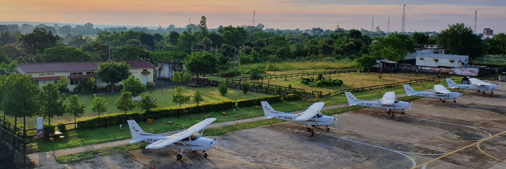

# Chimes Aviation Academy (CAA)

*Writer: Wingman Log | September 8, 2023 | 4 min read*

## Introduction

Aviation has this captivating allure that pulls people from all walks of life toward the skies. If you've ever dreamt of soaring amongst the clouds, then Chimes Aviation Academy could be your launching pad. It's not just a flight school; it's where your dreams of becoming a pilot can take off.

In this blog, we'll delve into the world of Chimes Aviation Academy, uncovering its journey, its fantastic facilities, its awesome training programs, and the inspiring success stories that have taken off from its runways.

## A Brief History

Chimes Aviation Academy, part of the Chimes Group, started its journey in 2008. Their mission? To create top-notch aviators. Over the years, they've made a name for themselves in the aviation education world, consistently churning out pilots that the industry can't get enough of.

## Facilities

What makes Chimes Aviation Academy tick? It's their awesome facilities, of course! Tucked away at the Dhana Airfield in Madhya Pradesh, India, this place sprawls across 100 acres of prime aviation real estate. Here's what you'll find:

1.  **Classrooms :** Picture modern classrooms with all the tech wizardry you'd want for a dynamic and interactive learning experience.
    
2.  **Simulator :** Chimes Aviation Academy's got these super-cool flight simulators. They let students practice flying under all sorts of conditions, without actually leaving the ground!
    
3.  **Aircraft Galore:** They've got a bunch of different planes – single-engine, multi-engine, you name it. You'll get to experience the joy of flying all kinds of aircraft.
    
4.  **Stay & Dine:** Living on campus? No problem! They've got comfy hostels and tasty food, so you can focus on your aviation dreams.
    
5.  **Fixing Things:** Their maintenance hangars are where the magic happens. You'll get hands-on experience learning about aircraft mechanics.

## Training Programs: Where Dreams Take Shape

Chimes Aviation Academy offers a variety of training programs designed to fit your aviation ambitions:

1.  **Private Pilot License (PPL):** This one's for budding pilots. You'll learn all the basics to become a private pilot.
    
2.  **Commercial Pilot License (CPL):** For those who want to make aviation a career, this program covers both theory and real-world flying.
    
3.  **Instrument Rating (IR):** Learn to fly like a pro, even in challenging weather conditions. It's all about becoming a versatile pilot.
    
4.  **Multi-Engine Rating (MER):** Going pro? This program will teach you to master multi-engine aircraft – an essential skill for airline pilots.
    
5.  **Type Rating:** If you've got your eye on specific commercial aircraft, Chimes Aviation Academy can help you get your type rating. That means you'll be all set for a career with airlines worldwide.  

## Indigo Cadet Program

Chimes Aviation Academy (CAA) and IndiGo have joined forces to introduce the Cadet Pilot Program (CPP), aimed at recruiting their Junior Flying Officers (JFOs). The primary objective of this initiative is to provide selected aspiring pilots with specialized training, enabling them to achieve their Commercial Pilot's License (CPL-MEIR) and A320 Type Rating.  

## Success Stories

Chimes Aviation Academy is all about nurturing dreams. Many of their graduates have gone on to do incredible things in the aviation world. They've landed jobs with top airlines, corporate aviation outfits, and even government agencies. The academy's commitment to excellent training has consistently produced pilots who are ready for the real deal in the aviation industry.

## Conclusion

Chimes Aviation Academy is more than just a flight school; it's the place where dreams take flight. With its impressive history, top-notch facilities, and a focus on producing skilled pilots, it's the perfect place to start your aviation journey. So, don't just dream about the sky; take off from Chimes Aviation Academy, where the sky's not the limit – it's just the beginning of your incredible journey.
