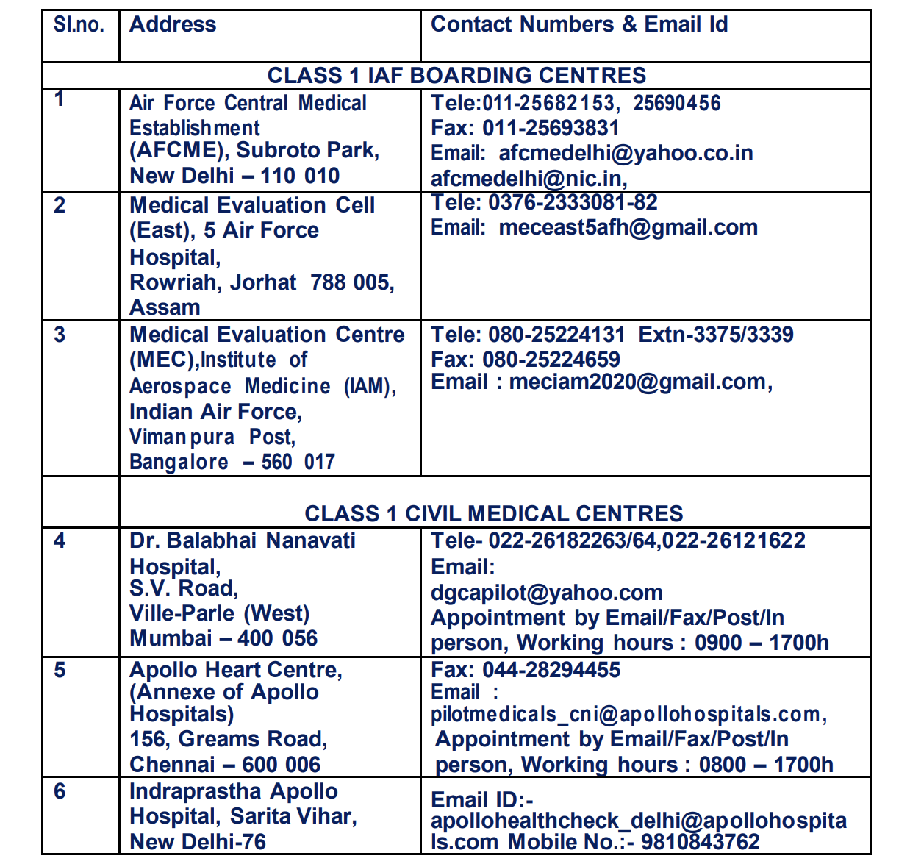
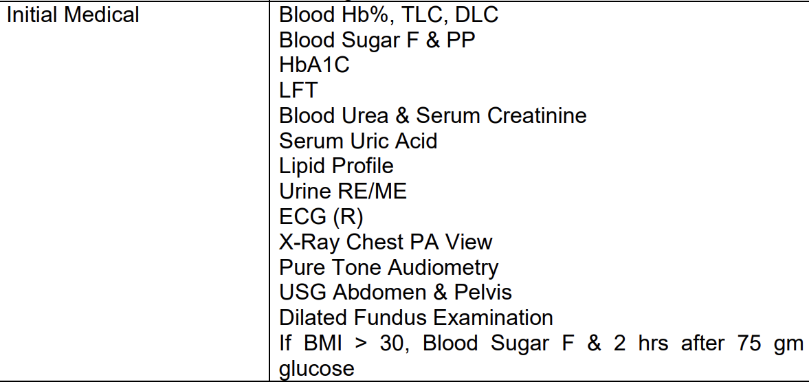

# How to Get Your DGCA Class 1 Medical in India: A Step-by-Step Guide

*Writer: Wingman Log | July 11, 2023 | 5 min read*

Whether you're starting your journey toward becoming a commercial pilot or maintaining your medical fitness, obtaining a DGCA Class 1 Medical is a crucial step. Let’s break down the process in a simple, aspirant-friendly way so you can navigate it without hassle.

> *DGCA Class 2 Medical examination is a pre-requisite to applying for a DGCA Class 1 medical. Don’t have Class 2 medical as well?*

> *Find out “*[***How to apply for class 2 medical in India”***](https://www.wingmanlog.in/post/class-2-medical-application) *and* [*“How to get your class 2 medical assessment on eGCA”*](https://www.wingmanlog.in/post/how-to-apply-for-class-2-medical-assessment-on-egca)

### **Step 1: Understand Your Medical Requirement**

Before diving into the process, determine whether you need an **initial Class 1 medical** or a **renewal**:

1.  #### Initial Class 1 Medical
    
    *   If you’re applying for a Class 1 medical for the first time, you must already hold a valid Class 2 medical.
        
    *   If your last Class 1 medical assessment was done over two years ago, you’ll need to apply for a **re-initial medical**.
        
    *   Initial medicals are conducted **only** at specific Indian Air Force (IAF) Boarding Centres.
        
2.  #### Renewal Class 1 Medical
    
    *   For those renewing their Class 1 medical, the validity depends on your age and operation type:
        
        *   **Under 40 years:** Valid for **1 year** in Multi-crew Commercial Air Transport Operations.
            
        *   **Above 40 years:** Valid for **6 months** in Single-crew Commercial Air Transport Operations.

*Follow the link attached below to apply for your Class 1 medical renewal now.*

### **Step 2: Initial Class 1 Medical—Where and How?**

#### **Approved Centers for Initial Medicals**

Initial medicals are conducted only at the following IAF Boarding Centers and a few other private hospitals. you can find all the details below.

*   **IAM, IAF Bangalore**
    
*   **AFCME, New Delhi**
    
*   **MEC(E), Jorhat**
    
*   **11 Air Force Hospital (11 AFH), Hindon**
    
*   **Apollo Hospitals, Chennai**
    
*   **Nanavati Hospital, Mumbai**
    
*   Indraprasatha Apollo Hospital,New Delhi Please find the address and contact details of all these hospitals.
    
    

#### **What You’ll Need**

1.  **No Objection Certificate (NOC)** from DGCA:
    
    *   Apply for the NOC through the eGCA portal.
        
    *   A medical appointment will only be granted after obtaining this.
        
2.  **Book an Appointment**:
    
    *   Ensure all your documents are in order when applying for an appointment.

### **Step 3: Renewal Class 1 Medical—Where and How?**

#### **Validity Timelines**

*   You can renew your medical within **one month before the expiry** of the previous one without any additional paperwork.
    
*   If renewing after the expiry date or more than two years since the last assessment, you’ll need an **NOC** from DGCA.

*Follow the link attached below to apply for your Class 1 medical renewal now.*

#### **Where to Go?**

Renewal medicals are conducted at:

1.  **IAF Boarding Centres** (same as above).
    
2.  **DGCA-empanelled Class 1 Medical Examiners**:
    
    *   These examiners operate at various locations across India.
        
    *   For the latest list of approved Class 1 Examiners, visit the [DGCA website](https://www.dgca.gov.in/digigov-portal/?page=jsp/dgca/InventoryList/personal/medical/class1/Class1.pdf):
        
        *   Go to **PERSONNEL > MEDICAL** to find the updated list.  

Class 1 centers & examiners.pdf

Download PDF • 249KB

### **Step 4: Application Process**

The [application process for a Class 1 Medical](https://www.wingmanlog.in/post/how-to-apply-for-class-2-medical-assessment-on-egca) is quite similar to that of a Class 2 Medical. Here’s a simplified guide:

1.  **Log in to the eGCA Portal**:
    
    *   Create an account or log in to your existing account on the [eGCA Portal](https://www.dgca.gov.in/digigov-portal/).
        
2.  **Apply for a Medical Appointment**:
    
    *   For initial medicals, select the preferred IAF center.
        
    *   For renewals, choose between an IAF center or an empanelled examiner.
        
3.  **Upload Documents**:
    
    *   Ensure all required documents (previous medical reports, NOC, etc.) are scanned and uploaded.
        
4.  **Payment**:
    
    *   Pay the applicable fees directly through the portal.
        
5.  **Confirmation**:
    
    *   Once your application is processed, you’ll receive confirmation of your appointment.  

Apply for Class 1 Renewal.pdf

Download PDF • 1.91MB

### **Step 5: What to Expect During the Medical Examination**

The medical examination includes a comprehensive assessment of:

*   Vision
    
*   Hearing
    
*   Cardiovascular health
    
*   Respiratory system
    
*   Neurological health
    
*   General fitness

The tests are as shown in the image for the initial medicals. Additional tests are to be undertaken at certain ages.

You may also be required to undergo additional tests depending on your medical history.

### **Tips for Aspirants**

1.  **Plan Ahead**: Medical slots at IAF centers can fill up quickly, so apply well in advance.
    
2.  **Stay Healthy**: Maintain a balanced diet, exercise regularly, and get enough sleep before the exam.
    
3.  **Check the DGCA Website**: Always refer to the [DGCA website](https://www.dgca.gov.in/) for the latest updates and requirements.

###   

Securing a Class 1 Medical is a vital milestone for every pilot. While the process might seem daunting at first, a systematic approach makes it manageable. By understanding the steps, gathering the required documents, and staying informed, you’ll be ready to ace your medical and take one step closer to your dreams of flying high!  

**Got questions? Drop a comment or check out the DGCA portal for more details.**
