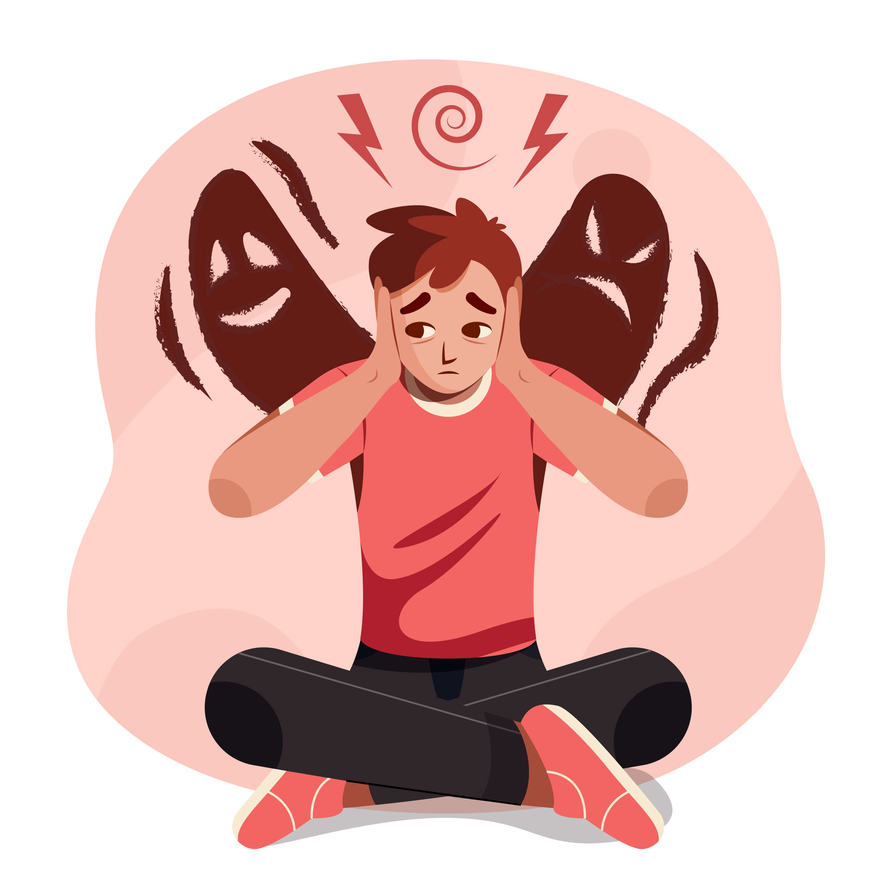
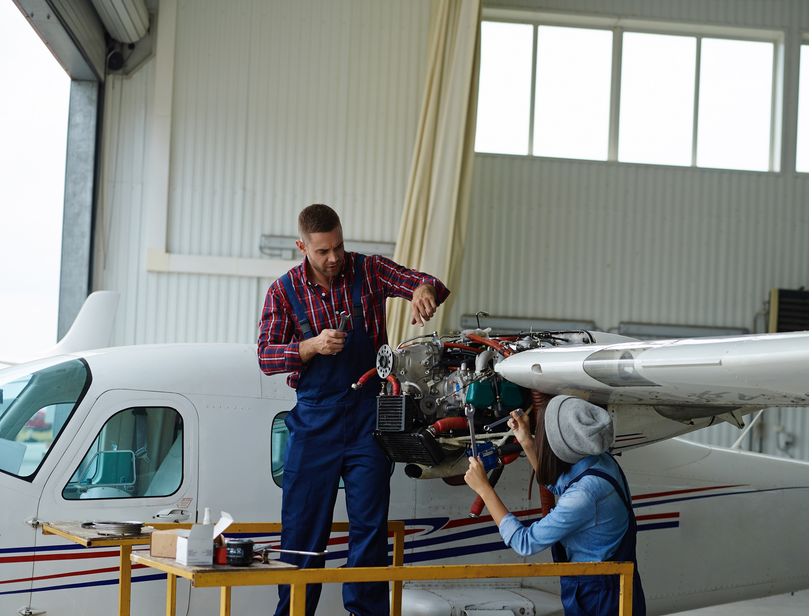

# Common Challenges Faced by Student Pilots

*Writer: Wingman Log | September 1, 2023 | 3 min read*

Becoming a pilot is a dream for many, and the journey begins with flight training as a student pilot. While the idea of soaring through the skies is thrilling, the path to becoming a certified pilot is not without its challenges. Student pilots face a unique set of obstacles that require dedication, perseverance, and a deep passion for aviation. In this article, we will explore some of the common challenges faced by student pilots as they embark on their flight training journey.

## 1\. Financial Constraints

One of the most significant challenges that student pilots encounter is the financial burden of flight training. The cost of obtaining a Commercial pilot's license (CPL) can vary widely depending on factors such as location, flight school, and aircraft types. Many aspiring pilots need to secure loans or work part-time jobs to cover the expenses. Managing finances while pursuing their dream can be a daunting task for student pilots.

## 2\. Weather-Dependent Training

Flying is highly dependent on weather conditions. Poor weather, such as heavy rain, fog, or strong winds, can disrupt flight lessons and delay progress. Student pilots must learn to adapt to weather-related challenges, which may mean rescheduling lessons or experiencing extended training timelines.

## 3\. Academic Demands

Flight training isn't just about getting behind the controls of an aircraft. It also involves a significant amount of ground school work. Student pilots must study subjects like aerodynamics, navigation, weather patterns, and aviation regulations. Balancing flight lessons with academic studies can be mentally demanding.

## 4\. Time Commitment

Flight training is time-intensive. Student pilots need to commit a substantial amount of time to complete the required flight hours and ground school coursework. This can be especially challenging for individuals with other responsibilities, such as jobs or family commitments.

## 5\. Physical and Mental Stress

Flying can be physically and mentally demanding. Student pilots often find themselves under a great deal of stress as they learn to handle various flight situations, from takeoffs and landings to emergency procedures. Maintaining focus and composure is crucial, and this can be challenging, particularly during the early stages of training.

## 6\. Flight Performance Plateaus

It's common for student pilots to experience plateaus in their flight performance. There are moments when it seems like progress has stalled, and this can be frustrating. Pilots must push through these plateaus with determination and continue refining their skills.

## 7\. Regulatory Hurdles

Navigating the regulatory framework of aviation can be daunting. Student pilots must become well-versed in aviation laws, rules, and procedures. The process of obtaining the necessary licenses and certifications can be complex and time-consuming.

## 8\. Aircraft Maintenance and Reliability

Student pilots often train in a variety of aircraft, and the maintenance and reliability of these planes can pose challenges. Flight cancellations due to unexpected maintenance issues can disrupt training schedules and increase costs.

## Conclusion

Becoming a pilot is a rewarding but challenging journey. Student pilots face financial, weather-related, academic, and time-related challenges. They must also cope with physical and mental stress, overcome plateaus in their performance, and navigate complex aviation regulations. Despite these hurdles, those who are passionate about flying and dedicated to their training can achieve their dream of becoming a certified pilot. The challenges they face during their training only serve to make them better, more capable aviators in the end.
