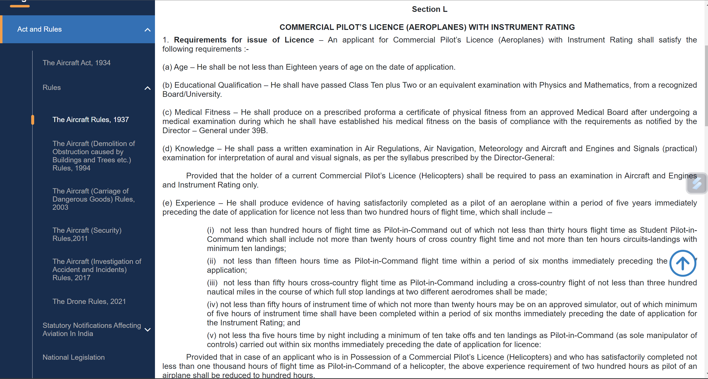
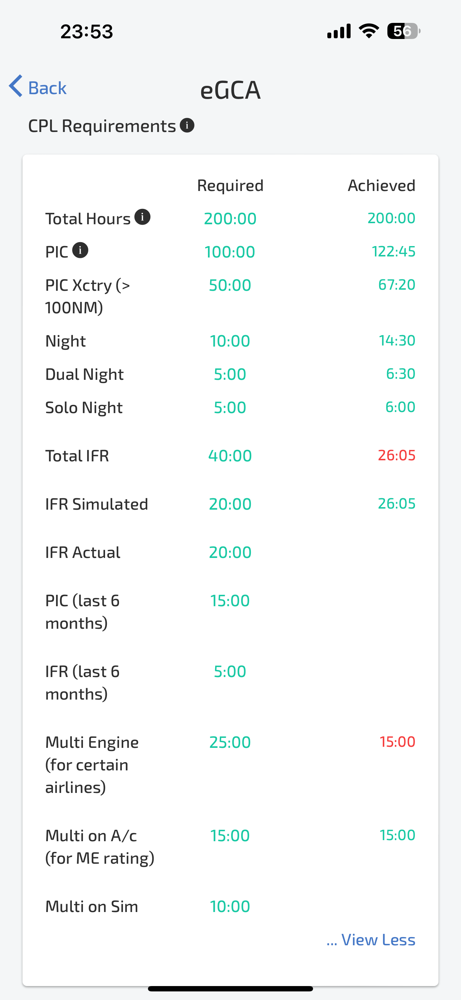

# CPL Flying Requirements in India

*Writer: Wingman Log | December 29, 2023 | 3 min read*

Dreaming of soaring through the clouds and commanding a commercial plane? It's an exhilarating vision, isn't it? Becoming a commercial pilot in India is not just about chasing a dream but also about meeting specific requirements and demonstrating key characteristics. Let's take a closer look at the journey to obtaining a Commercial Pilot License (CPL) in India and the essential qualities that make a good commercial pilot.

## The Path to CPL in India

### ***1\. Academic Qualifications***

To embark on the journey of becoming a commercial pilot in India, a strong academic foundation is necessary. You must have completed 10+2 with mathematics and physics or hold an equivalent diploma.

### ***2\. DGCA Requirements***

The Directorate General of Civil Aviation (DGCA) sets forth the minimum requirements for obtaining a CPL. These include:

\- 100 hours of pilot in command (PIC)

\- 250 nautical miles cross country check

\- 40 hours instrument flight (20 hours may be on a simulator)

\- 50 hours solo cross country

\- 120 nautical miles check

\- 15 hours multi-engine

\- 300 nautical miles solo cross country

\- 10 take-offs and landings by night

These prerequisites can be fulfilled by enrolling in a DGCA authorized flying school and completing a commercial pilot training course.  

Keep track of the CPL flying requirements just by downloading the Wingman app for free.

[https://onelink.to/wingman](https://onelink.to/wingman)  

### ***3\. Medical Assessment***

Ensuring your physical fitness is crucial. Clearing both Class II and Class I medical assessments by DGCA is a must.

### ***4\. Theory Exams***

In addition to the flying hours, aspiring pilots need to pass the DGCA CPL theory exams and the RTR exam.

### ***5\. Additional Training and Tests***

Upon completing the required training, there might be additional tests and training specific to the airline you join.

### ***6\. Advancement***

Starting as a co-pilot, you gain experience before advancing to the rank of a captain based on seniority and experience. Exams, both written and practical, are part of the journey at every step.

## The Five Cs: Essential Characteristics for Success

**Commitment**

The journey to becoming a commercial pilot demands dedication. It's challenging, costly, and time-consuming. A strong desire and self-motivation are key to overcoming the hurdles.

**Confidence**

Confidence is the pilot's ally in making critical decisions, especially when navigating through challenging weather conditions. Self-assurance is a prerequisite for a successful pilot.

**Communication**

Effective communication is not just a skill but a responsibility for pilots. Clear communication with fellow pilots, cabin crew, and the ground team minimizes the risk of accidents.

**Calmness and Composure**

The ability to maintain composure in critical situations is vital. A competent pilot stays focused on piloting the aircraft, ensuring safety even in unexpected circumstances.

**Fitness**

Fitness for duty is a priority, encompassing physical, mental, emotional, and cognitive aspects. A well-conditioned physical and mental state is crucial for those aiming to take the skies.

In conclusion, the journey to becoming a commercial pilot in India is both challenging and rewarding. It requires a combination of academic qualifications, rigorous training, and the embodiment of essential characteristics. So, if you're ready to commit, stay confident, communicate effectively, keep your cool, and maintain your fitness—welcome aboard the adventure of a lifetime!
