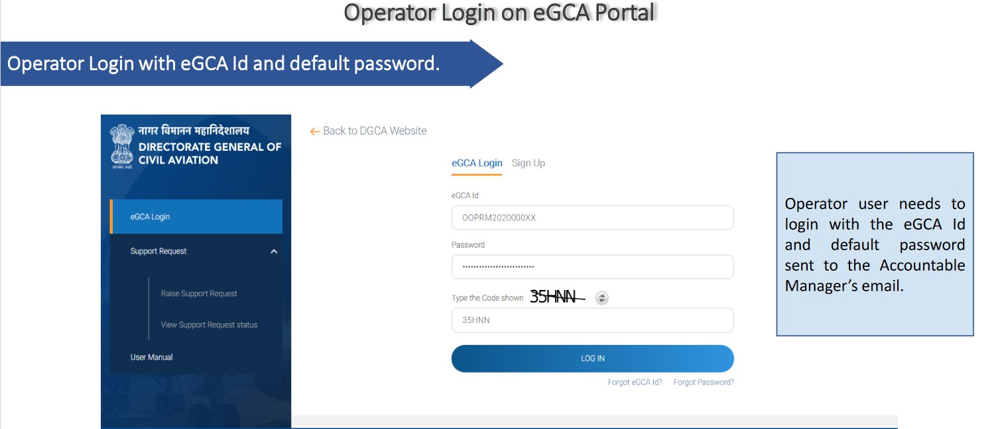
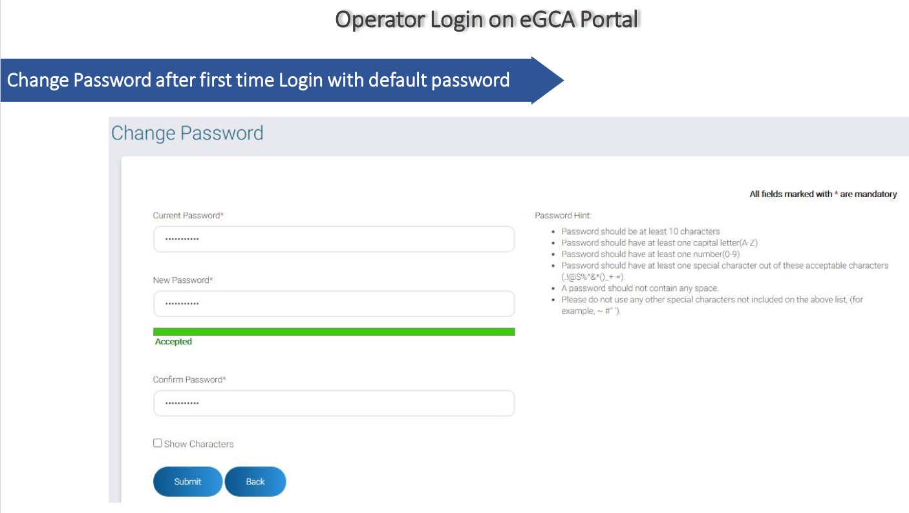
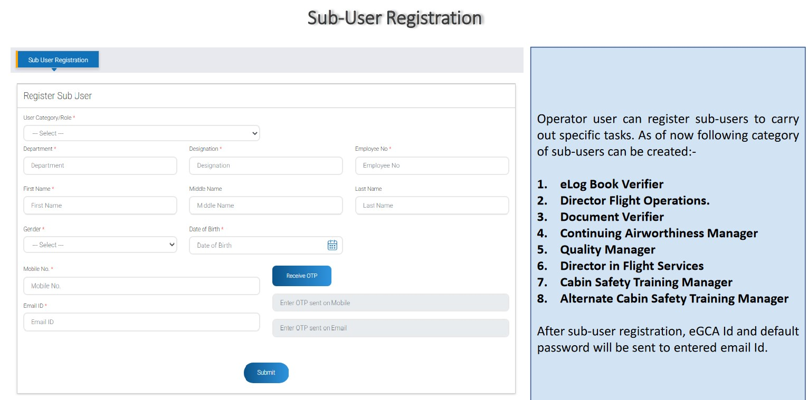
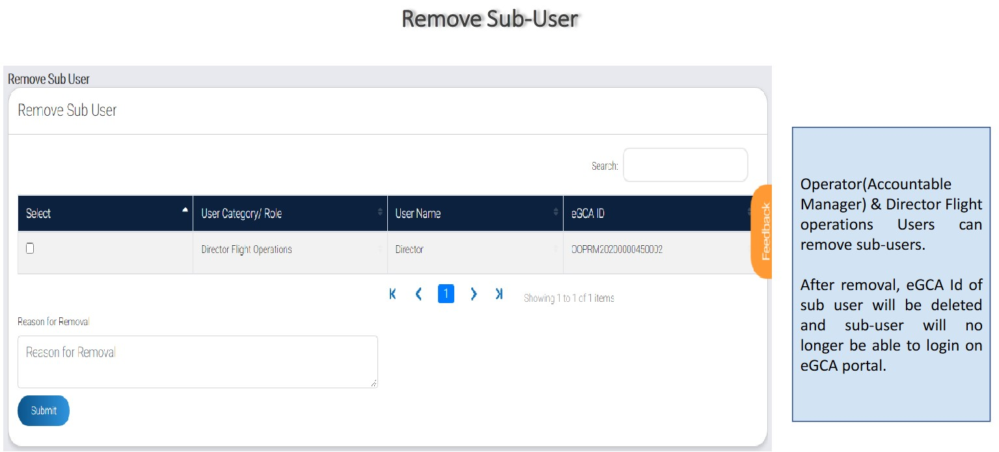
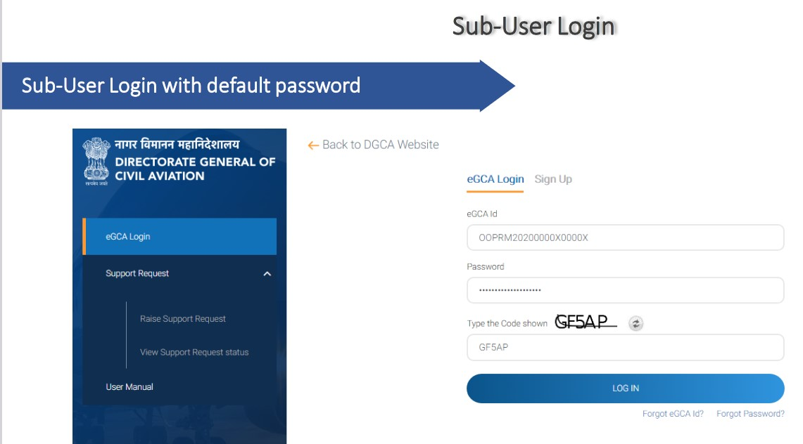
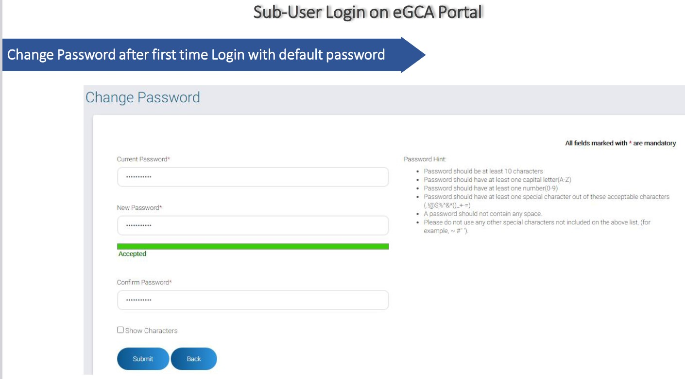
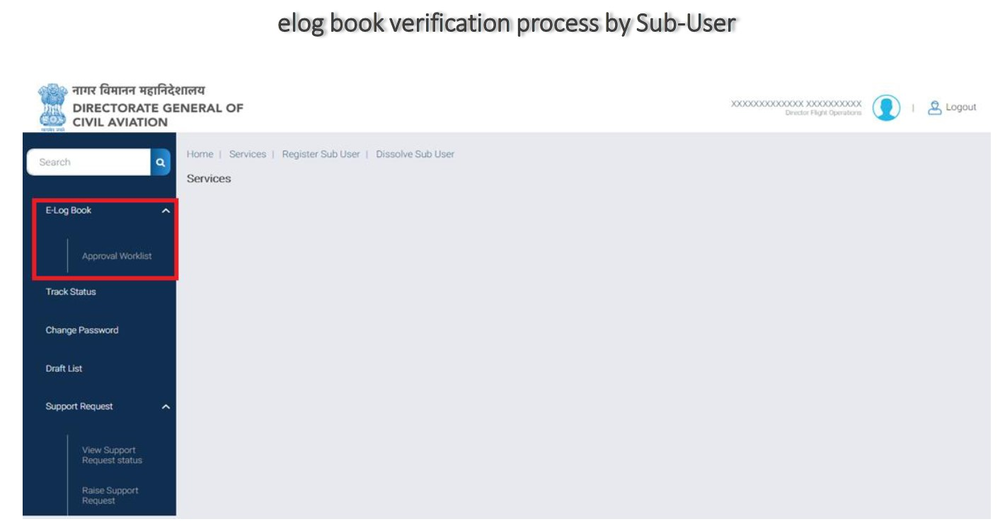
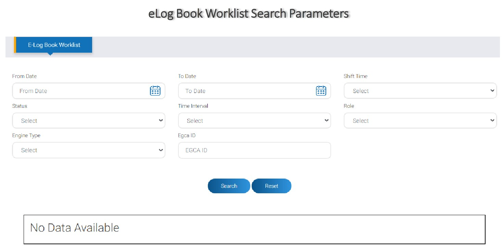
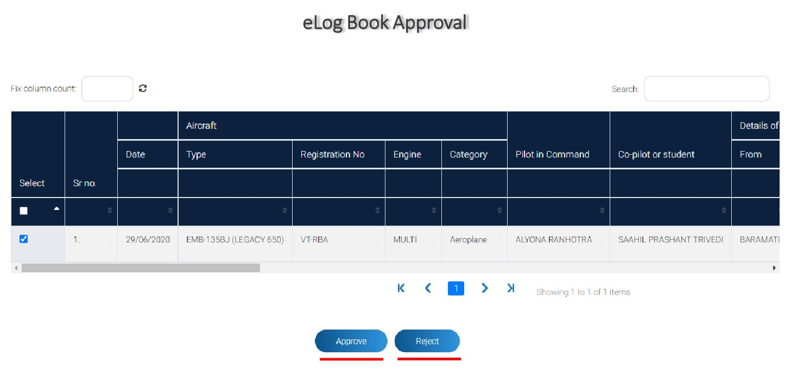

# Existing Operator Registration on eGCA

*Writer: Wingman Log | August 14, 2023 | 4 min read*

In the ever-evolving landscape of civil aviation, digital transformation has become an imperative. To facilitate streamlined communication, improved services, and enhanced efficiency, the Directorate General of Civil Aviation (DGCA) has introduced the e-Governance of Civil Aviation (eGCA) project. One of the key components of this initiative is the Existing Operator Registration process. This blog aims to provide a comprehensive guide to the Existing Operator Registration on the eGCA Portal.

## What is Existing Operator Registration?

Organizations approved and registered as Scheduled, Non-Scheduled, General Aviation Operators, etc. with DGCA play a pivotal role in the aviation ecosystem. These organizations are now offered the opportunity to register on the eGCA Portal, granting them access to a range of services under the e-Governance of Civil Aviation framework. This online platform acts as a central hub for aviation-related activities, enabling operators to streamline their interactions with various directorates.

## Why is Registration Required for Operators?

The registration process serves as a gateway to unlock a multitude of services offered by different directorates within the eGCA project. By registering, operators gain access to an array of tools and functionalities that enhance the efficiency and effectiveness of their operations. This digital transformation promotes transparency, speed, and accuracy in aviation-related processes.

## Process Flow: Operator Login on eGCA Portal

### Step 1: Operator (Accountable Manager) Login

Upon receiving their eGCA ID and default password via email, the operator's Accountable Manager can log in to the eGCA Portal. This initial login allows operators to gain entry to the portal and its various services.

### Step 2: Change Password

For security reasons, it's essential to change the default password upon the first login. This step ensures the confidentiality and integrity of the operator's account.

### Step 3: Access Services

The operator is directed to the homepage, where they can access a variety of services. This is the control center from which they can manage their aviation-related tasks.

### Step 4: Sub-User Registration

Operators have the ability to delegate specific tasks to sub-users. These sub-users can be created for roles such as eLog Book Verifier, Director of Flight Operations, Document Verifier, and more. Each sub-user receives an eGCA ID and default password via email.

### Step 4: Remove Sub-User

The operator and Director of Flight Operations users have the authority to remove sub-users as required. This action deactivates the sub-user's access to the portal, enhancing security and control over the system.

## Process Flow: Sub-User Login on eGCA Portal

### Step 5: Sub-User Login

Sub-users log in using their assigned eGCA ID and default password. Similar to the operator, the sub-user is prompted to change the password upon first login.

## Process Flow: eLog Book Verification Process by Sub-User

### Step 6: Access eLog Book and Approval Worklist

Sub-users can navigate to the eLog Book section and access the approval worklist. This section is crucial for verifying and approving entries in the electronic logbook.

### Step 7: eLog Book Worklist Search

Sub-users can search the eLog Book worklist using various parameters, enabling them to efficiently locate relevant entries for approval.

### Step 8: Approve or Reject Entries

Based on the entries presented in the worklist, sub-users can either approve or reject them as necessary. This step contributes to maintaining accurate and up-to-date records in the eLog Book.

In conclusion, the Existing Operator Registration process on the eGCA Portal marks a significant leap forward in modernizing civil aviation operations. By embracing digital transformation and utilizing the eGCA platform, operators can streamline their interactions, enhance efficiency, and contribute to the overall advancement of the aviation industry. This proactive approach to leveraging technology underscores the commitment of the DGCA to foster innovation and excellence within the aviation ecosystem.

Refer to this pdf for more details.

Existing Operator Registration Process.pdf

Download PDF • 1.96MB
