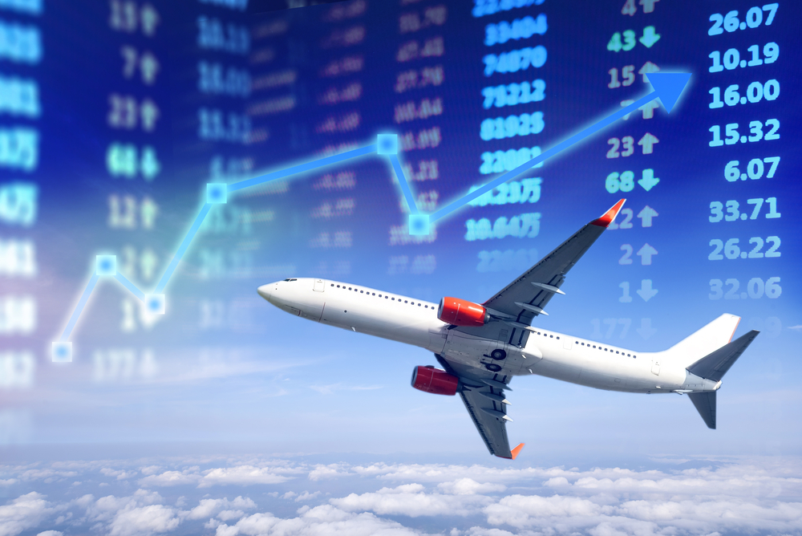
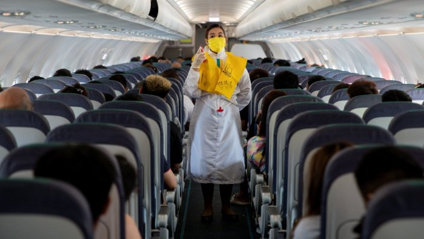

# Growth of Indian Aviation, Impact of COVID-19 & the New Normal

*Writer: Wingman Log | July 23, 2023 | 5 min read*

The Indian aviation industry has witnessed an incredible journey over the years, evolving from humble beginnings to becoming one of the fastest-growing aviation markets in the world. However, just as it seemed like the industry was reaching new heights, the unforeseen turbulence caused by the COVID-19 pandemic disrupted the aviation landscape, leaving airlines and stakeholders grappling with unprecedented challenges. In this blog, we'll explore the growth trajectory of Indian aviation, highlighting key metrics, and delve into the profound impact of the pandemic on this thriving sector.

***Taking Flight: The Growth of Indian Aviation***

The roots of Indian aviation can be traced back to 1911 when the first commercial flight took off from Allahabad, but it was post-independence that the industry began to spread its wings. Over the years, various policy reforms, economic liberalization, and advancements in technology bolstered the aviation sector. Here are some noteworthy metrics that exemplify the growth of Indian aviation:

1.  **Passenger Traffic Surge:** Indian airports have witnessed an exponential increase in passenger traffic. In 1991, the total passenger count stood at a mere 18 million, which skyrocketed to an astounding 344 million in 2019.
    
2.  **Low-Cost Carrier Revolution:** The introduction of low-cost carriers (LCCs) revolutionized air travel in India. Airlines like IndiGo, SpiceJet, and GoAir democratized flying by offering affordable fares, and as a result, LCCs currently account for more than 65% of the domestic market share.
    
3.  **Fleet Expansion:** To meet the growing demand for air travel, Indian carriers embarked on ambitious fleet expansion programs. In 2000, the combined fleet size of Indian airlines was around 150 aircraft, whereas by 2019, it had surged to over 650 aircraft.
    
4.  **International Connectivity:** Indian carriers also spread their wings globally, expanding their international networks. The number of international passengers grew from 15 million in 2000 to over 70 million in 2019.
    
5.  **Airport Infrastructure:** Modernization and expansion of airports played a crucial role in accommodating the increased air traffic. Airports like Delhi, Mumbai, and Bengaluru underwent significant transformations, becoming world-class aviation hubs.

***Impact of COVID-19 on Indian Aviation***

Just when the Indian aviation industry seemed invincible, the COVID-19 pandemic struck, bringing the world to a standstill. The impact on the aviation sector was profound, and India was no exception. Here's a closer look at the repercussions:

1.  **Massive Drop in Passenger Traffic:** With lockdowns and travel restrictions in place, air travel came to a grinding halt. Passenger traffic plummeted to almost negligible levels, causing a sharp decline in revenue for airlines.
    
2.  **Financial Crisis for Airlines:** The prolonged grounding of flights led to a severe financial crisis for Indian carriers. Even well-established airlines struggled to stay afloat, with some facing the risk of bankruptcy.
    
3.  **Job Losses and Salary Cuts:** Airlines, to cut costs, resorted to layoffs and salary cuts, impacting thousands of employees across the industry. Pilots, cabin crew, ground staff, and maintenance personnel were among the worst affected.
    
4.  **Uncertain Future for Airports:** The aviation downturn also impacted airports, many of which heavily depend on passenger revenues. Concessionaires, retail outlets, and other airport businesses faced significant losses.
    
5.  **Slow Recovery:** Despite the gradual easing of restrictions, the road to recovery remained arduous. Travel apprehensions and ever-changing regulations continued to dampen passenger confidence.

***Looking Ahead : Navigating the New Normal***

While the COVID-19 pandemic dealt a severe blow to Indian aviation, the industry has proven its resilience time and again. As vaccination efforts expanded and global travel sentiment improved, signs of recovery began to emerge. However, it became evident that the pandemic reshaped certain aspects of the industry permanently:

1.  **Digital Transformation:** The pandemic accelerated the adoption of technology in various aviation processes, including contactless check-in, digital health passports, and touchless security checks.
    
2.  **Focus on Safety and Hygiene:** Passenger safety took center stage, and airlines and airports implemented stringent hygiene measures to restore confidence among travelers.
    
3.  **Reimagining Business Models:** Airlines explored new revenue streams and business models to adapt to the changing travel landscape. Cargo operations, charter flights, and repurposing passenger aircraft for cargo became popular strategies.
    
4.  **Sustainable Aviation:** The industry embraced sustainability with increased focus on fuel-efficient operations, alternative fuels, and eco-friendly initiatives to reduce its carbon footprint.

The growth of Indian aviation has been nothing short of remarkable, with the industry overcoming various challenges to become a key player in the global market. However, the COVID-19 pandemic served as a stark reminder of the vulnerability of the aviation sector to external shocks. As the industry embarks on its journey to recovery, the lessons learned from this tumultuous period will shape a more resilient and sustainable future for Indian aviation. So, let us fasten our seatbelts, for the aviation industry in India is undoubtedly ready to soar to new heights once again.
