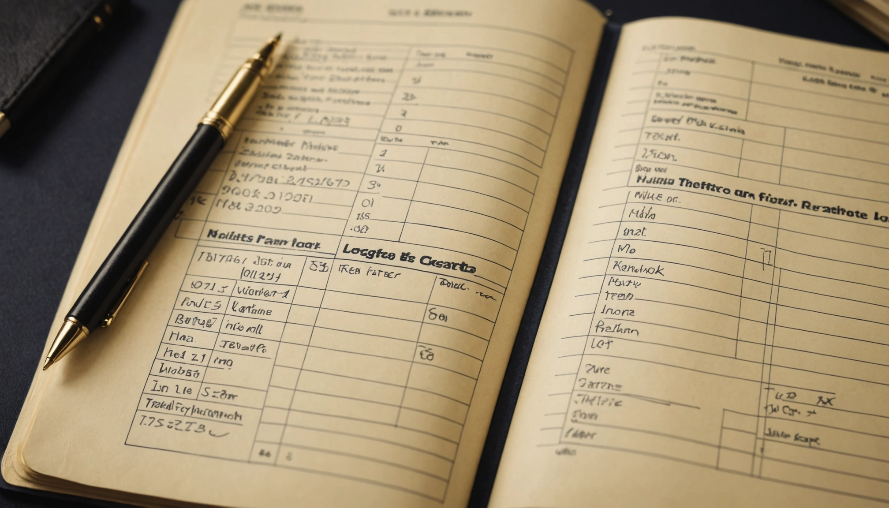
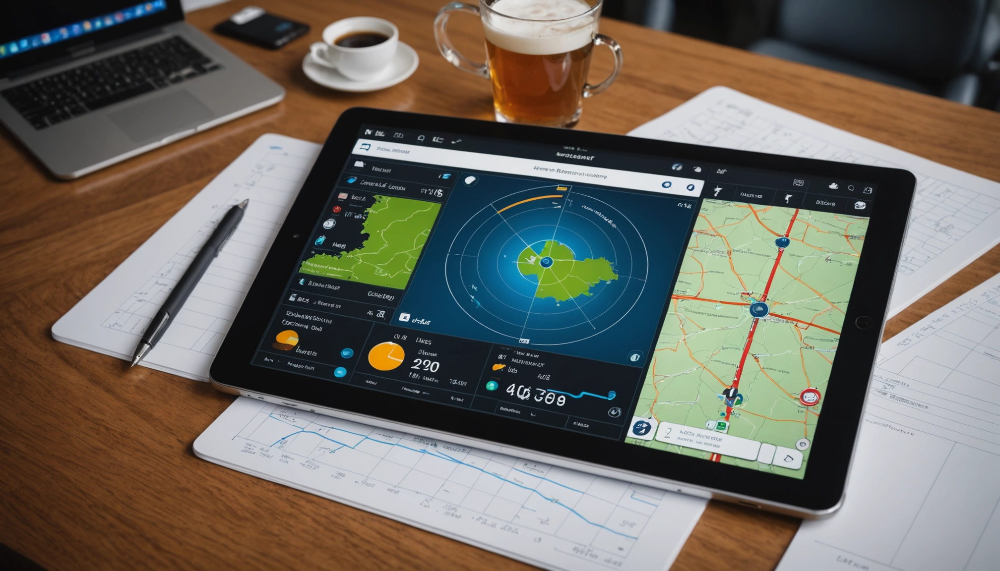

# How Pilots Maintain Accurate Flight Records

*Writer: Wingman Log | March 31, 2025 | 5 min read*

*   Mar 31

Maintaining accurate flight records is crucial for pilots. These records serve as a vital part of a pilot's career and safety. Accurate logging can also enhance their professional reputation and provide both legal protection and career opportunities.

## Understanding Flight Records

Flight records typically include logs of hours flown, type of aircraft, flight conditions, and other essential details. Every nation has its specific regulations when it comes to record-keeping for pilots. For instance, in the United States, the Federal Aviation Administration (FAA) requires pilots to maintain flight logs that detail their flight hours and experiences.

Logs often include information such as:

*   Flight date
    
*   Aircraft type and registration number
    
*   Flight time and duration
    
*   Pilot's signature
    
*   Total flight hours

Accurate records help pilots track their progress and experience, making them more prepared for various flying scenarios.

Pilot's logbook with detailed entries showcasing flight record notation.

## The Importance of Keeping Flight Records

Keeping flight records isn't just about compliance with regulations. It's fundamental for personal development. Many airlines and aviation companies require pilots to provide documented proof of their flying hours before employment. Inaccurate or incomplete records could result in lost job opportunities or even legal complications.

In addition to career advancement, keeping detailed flight records ensures that pilots can prepare for medical examinations. A well-maintained record can illustrate the pilot's active status and compliance with flying regulations.

When we consider a study conducted by the National Transportation Safety Board (NTSB), they found that the majority of aviation accidents involved human error. Good record-keeping practices can help mitigate risks and enhance overall safety.

## Can you use ForeFlight as a logbook?

ForeFlight is a popular aviation app loaded with features designed to assist pilots during their flights. One of these features includes a digital logbook. Pilots can log their flights directly in the app where they can also integrate other essential tools.

While ForeFlight cannot fully replace traditional logbooks, as per FAA requirements, it provides a handy way to manage your flight records effectively. Pilots can create a detailed and organized record that syncs with their other managed data.

However, it remains essential for pilots to validate their entries and ensure they adhere to regulatory requirements. Using an integrated approach can make record-keeping more convenient and efficient.

ForeFlight app displayed on a tablet showcasing its flight logging features.

## Tools for Keeping Accurate Flight Records

1.  **Traditional Logbooks**: Many pilots still prefer the traditional method of recording flights in a physical logbook. These books have designated fields for entering details about each flight, making it easy to take notes.

2.  **Digital Logbooks**: With the advancement of technology, digital logbooks have become increasingly popular. The [**pilot logbook app**](https://www.wingmanlog.in/) allows users to streamline their logging process. Digital logbooks are easy to update, save, and backup online, making them a practical option for many pilots.

3.  **Spreadsheets**: Some pilots utilize spreadsheets to compile their records. This method requires more technical skill but allows for more customization. However, it can be time-consuming to set up.

Using these tools helps ensure that recording is hassle-free and accurate. Whatever method a pilot chooses, maintaining regular updates is a key factor in staying organized.

## Best Practices for Accurate Flight Logging

To maintain accurate flight records, pilots should adopt the following best practices:

*   **Log Immediately**: It's best to enter flight data immediately after completion to avoid forgetting important details.

*   **Be Detailed**: Including more than just flight time can be helpful. Record the purpose of the flight, any specific maneuvers practiced, and weather conditions to build a richer account of your experience.

*   **Review Regularly**: Set aside time to review your logs periodically. This can help highlight any inconsistencies or missing information that needs to be addressed.

*   **Use Checklists**: Prepare a checklist of necessary items to log. This can help ensure no important details are missed during entries.

*   **Be Consistent**: Consistency is key. Adhering to the same format each time you log can simplify the process and make records easier to read.

By following these practices, pilots can ensure their records are complete and reliable, limiting potential issues down the line.

## Concluding Thoughts on Flight Record Management

Maintaining accurate flight records is vital for any pilot. A well-maintained logbook not only meets regulatory requirements but also supports career advancement and personal safety. With tools like digital logbooks and apps, managing these records has never been easier.

Ultimately, whether utilizing a *traditional method* or a *pilot logbook app*, staying organized and keeping records up-to-date plays a crucial role in every pilot’s journey.

Organized desk with a pilot logbook and other writing essentials, showcasing a pilot’s preparation for logging flights.
