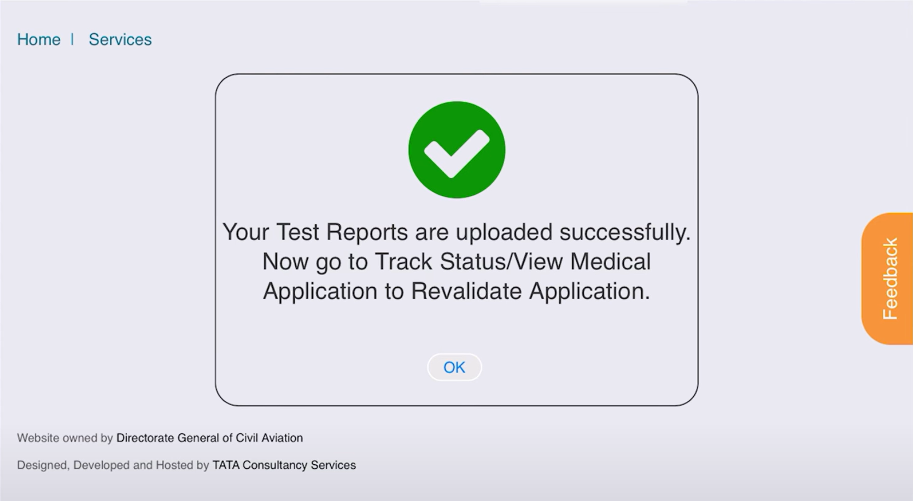

# Application of Class 1 Renewal Medicals on Egca

*Writer: Wingman Log | October 18, 2023 | 5 min read*

## Understanding Class 1 Medical for Pilots in India

In India, flying high in the skies as a pilot is a thrilling and responsible profession. Whether you are an aspiring aviator or a seasoned flyer, maintaining a Class 1 Medical certificate is a crucial part of your journey. In this blog post we detail the steps required to be followed to apply for class 1 medical renewal on eGCA.

## Class 1 Medical Prerequisites

Before we dive into the step-by-step process of applying for a Class 1 Medical certificate on eGCA, let's quickly go over the prerequisites:

1\. ***Medical Clearance Renewal***: All candidates, whether you're just starting out or renewing your license, must obtain a medical clearance. This ensures that your health is in good standing for piloting.

2\. ***Valid eGCA ID***: To begin the application process, make sure you are registered on the DGCA portal with a valid eGCA ID. If you're not already registered, don't worry; we'll guide you through this - [https://www.wingmanlog.in/post/how-to-get-your-egca-id](https://www.wingmanlog.in/post/how-to-get-your-egca-id)

3\. ***Approved NOC***: You'll need an approved No Objection Certificate (NOC) from the Medical Directorate. This document confirms that you are medically fit to fly.

4\. ***Age Requirements***: You should be at least 16 years old but not more than 65 years of age. This age range ensures that candidates are physically and mentally fit for the role.

5\. ***Renewal Based on Last Assessment***: Your medical certificate renewal is based on the last assessment's validity. Make sure you keep track of when your last medical assessment was done.

Now that you understand the prerequisites, let's break down the application process into simple, easy-to-follow steps:

### Step 1: Register on the DGCA Portal

First, you need to register on the DGCA portal and obtain a valid eGCA ID. This ID is essential for the entire application process.

If you don't have one, no worries; we'll guide you through it. You'll receive your unique ID through email or text message.

Login to the eGCA website - [https://www.dgca.gov.in/digigov-portal/jsp/dgca/common/login.jsp](https://www.dgca.gov.in/digigov-portal/jsp/dgca/common/login.jsp)

### Step 2: Request a Medical Assessment

Once you have your eGCA ID, visit the eGCA portal again to raise a request for a medical assessment.

After logging in, go to ***Services -> Medical -> Renewal of Class 1 Medical***

### Step 3: Choose a Class 1 Examiner

On the portal, select a DGCA empaneled Class 1 Examiner for your medical assessment. The examiner's expertise is crucial in this process.

Class 1 Medical Examiners.pdf

Download PDF • 538KB

### Step 4: Fill Out the e-Form

Now, you'll need to fill out an e-form with your personal details and medical declaration. Ensure that you provide all the necessary information and submit the application online, including a recent photograph.

### Step 5: Application ID and Blood Tests

Upon form submission, an application ID will be generated, and you'll receive an email and SMS notification. The email will contain a list of blood tests you need to perform.

***Note : Format of an e application***

***EApplication ID YYYY/eGCA ID/MD/MEA/0000000001***

### Step 6: Upload Investigation Reports

Before your actual medical examination, make sure to upload any required investigation reports. This step streamlines the process when you visit the medical examiner.

**Once you upload the reports, make sure you follow the steps to Revalidate the application which sends the application to your medical examiner.**

### Step 7: Visit the Examiner

It's time for your actual medical examination! Visit the DGCA empaneled Class 1 Examiner, validate the form in front of the examiners, and carry a hard copy of the ID proof you uploaded during registration.

### Step 8: Getting the CA 35

After the examination, the examiner will conduct a checkup and issue a CA-35 medical certificate if you're deemed fit. This certificate can be downloaded from the eGCA portal for your records. ***Services -> Medical Services -> Download Certificate/Assessment -> View CA 35***

Your medical application will be received by the DMS(CA) at the Medical Directorate, who will mark you as fit, temporarily unfit, or permanently unfit based on the assessment.

### Step 9: Results of Your Assessment

If you're deemed fit, your medical assessment will be sent through the eGCA portal and via email. In case of temporary unfitness, recommendations will be communicated to you via email. If you're permanently unfit, your application goes to DGMS (air) for approval.

### Step 10: Access Your Medical Assessment

Finally, a medical assessment will be generated, and a PDF will be available for download at the eGCA portal, accessible through your applicant login. ***Services -> Medical Services -> Download Certificate/Assessment -> View Medical Assessment***

That's it! You've successfully renewed your Class 1 Medical on eGCA, ensuring that you're physically fit to take to the skies. Renewing your medical certificate is vital for pilots, so follow these steps, maintain good health, and keep the spirit of aviation alive!
