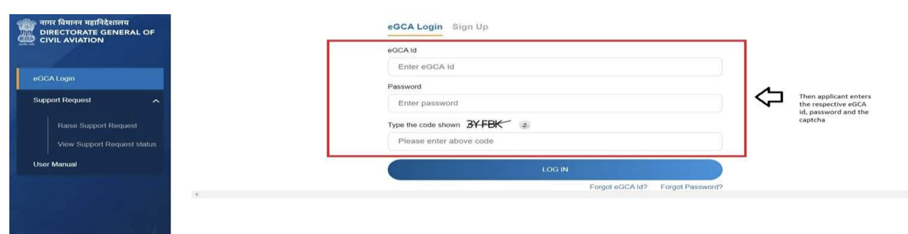
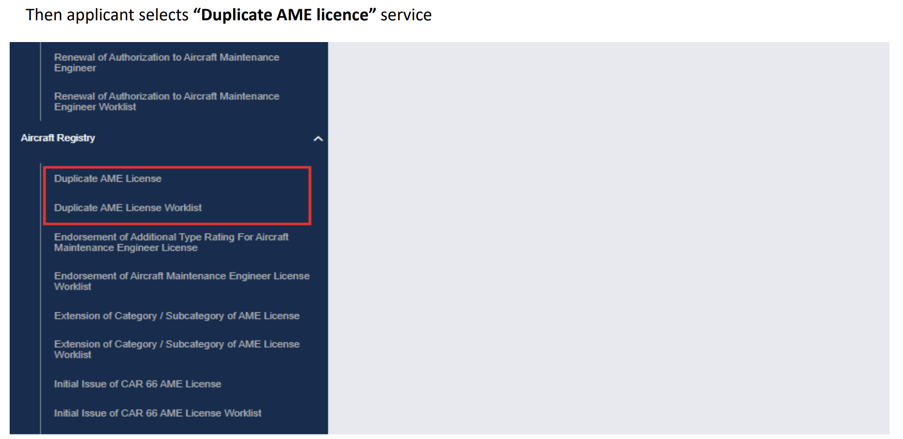
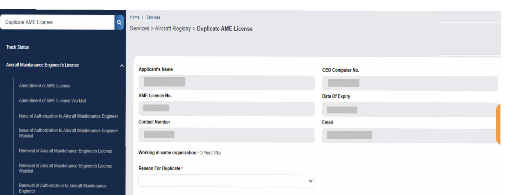
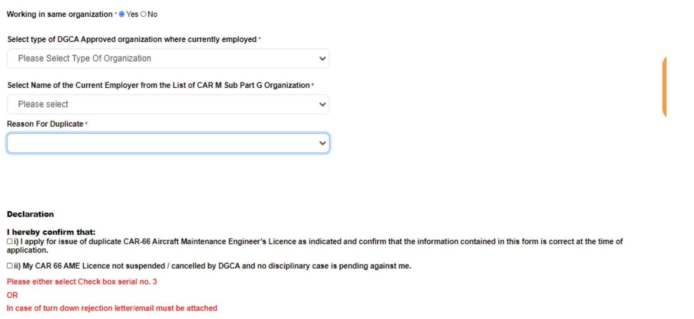
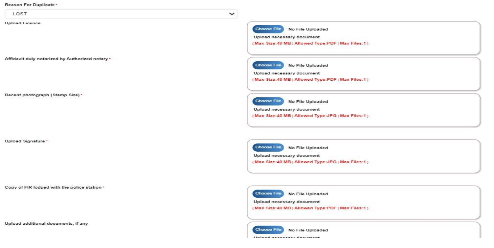
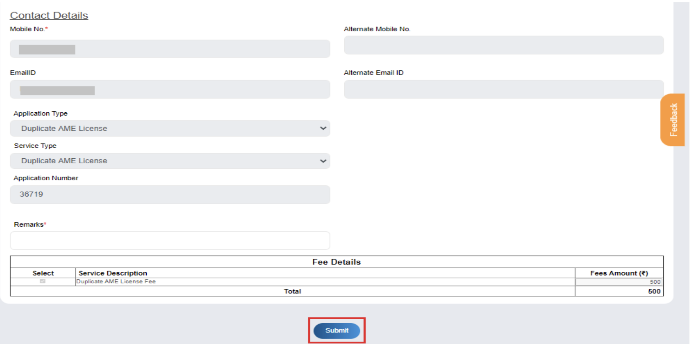
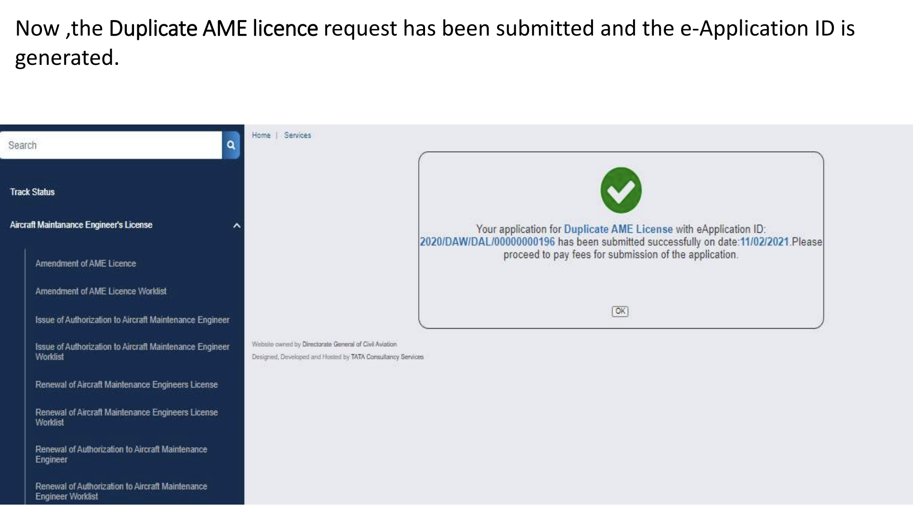
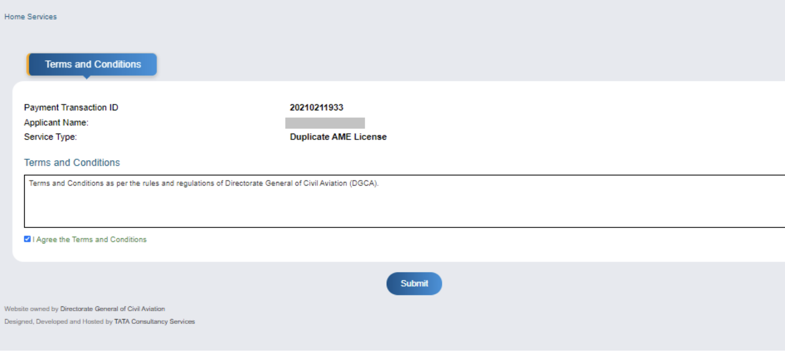
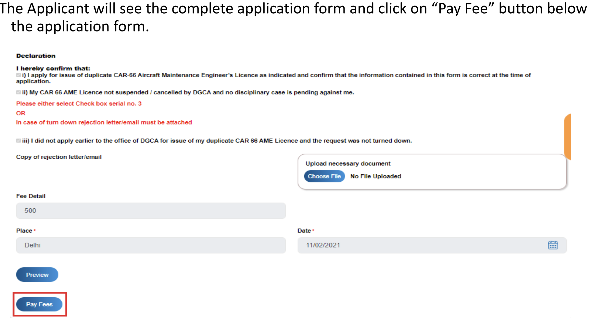
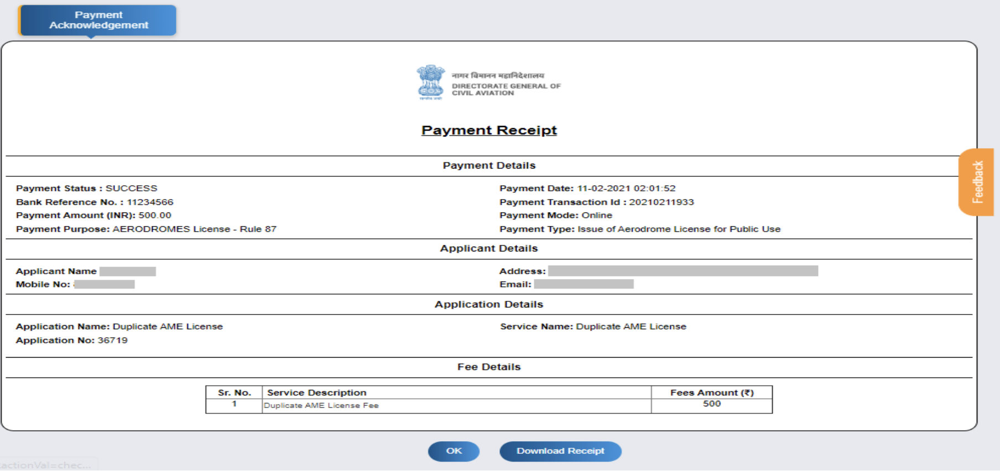

# How to Apply for Duplicate AME License on eGCA ?

*Writer: Wingman Log | August 20, 2023 | 4 min read*

Losing important documents can be an inconvenience that disrupts our daily lives. In the world of aviation, losing an Aircraft Maintenance Engineer (AME) licence can be a significant setback. However, thanks to the technological advancements in the aviation sector, obtaining a duplicate AME licence has become much more accessible and efficient through the eGCA portal. In this blog post, we'll walk you through the step-by-step process of applying for a Duplicate AME Licence on the eGCA platform.

## Introduction to Duplicate AME Licence Application

The Duplicate AME Licence application service caters to individuals who need to replace their lost, misplaced, or mutilated original AME licence. This service simplifies the process, making it convenient for AME licence holders to get back on track swiftly.

**Pre-Requisites for Applying for a Duplicate AME Licence**

Before diving into the application process, ensure you have the following prerequisites in place:

1.  **eGCA Registration**: You must already be registered on the eGCA portal and have a valid eGCA ID.
    
2.  **Access to DGCA Website**: You should have access to the DGCA website, which is essential for completing the application.
    
3.  **FIR Report**: If your original AME licence has been lost or stolen, you need to have logged a First Information Report (FIR) with the police.
    
4.  **Valid AME Licence**: You must possess a valid AME licence, as this is a requirement for applying for a duplicate.

## The Step-by-Step Application Process

Now, let's break down the process of applying for a Duplicate AME Licence on the eGCA portal:

**Step 1: eGCA Login** Start by visiting the eGCA portal and clicking on the "eGCA Login" option.

**Step 2: Provide Credentials** Enter your eGCA ID, password, and the captcha code to access your account.

**Step 3: Navigate to "Services"** Once logged in, select the "Services" option from the menu.

**Step 4: Select "Duplicate AME Licence" Service** Under the services menu, choose the "Duplicate AME Licence" service.

**Step 5: Populate Applicant Details** Relevant details such as your name, CEO Computer No., AME licence number, its expiry date, and your contact information will be automatically populated.

**Step 6: Employment Details** Indicate whether you are currently working in the same organization or not. Provide your current employer details if applicable.

**Step 7: Reason for Duplicate and Document Upload** Select the reason for needing a duplicate licence and upload the necessary documents based on your chosen reason.

**Step 8: Declaration and Submission** Read and check the declaration box, then submit the application form.

**Step 9: Payment Process** Upon submission, you'll be directed to the Bharatkosh payment gateway to pay the required fees for the application.

**Step 10: Fee Payment and Submission** In the Applicant worklist, review the fee details, add any necessary remarks, and proceed to pay the fees. After payment, a transaction receipt will be generated.

## Application Status and Completion

Congratulations! You've successfully applied for a Duplicate AME Licence through the eGCA portal. You can track the progress of your application through the Duplicate AME Licence Worklist. Once the application is processed, you'll be notified of the status, and you can access your duplicate licence as needed.

In conclusion, the eGCA portal has revolutionized the process of obtaining a Duplicate AME Licence. With its user-friendly interface and streamlined steps, this service simplifies the journey for those who need to replace their AME licence. By following the steps outlined above, you'll be well on your way to getting back in the cockpit and continuing your vital role in the aviation industry.

Refer to this pdf for more details.

Duplicate AME license.pdf

Download PDF • 1.67MB
