# How to apply for NOC for your medicals on eGCA?

*Writer: Wingman Log | October 20, 2023 | 5 min read*

Are you an aspiring aviator, air traffic controller, or an existing aircrew member looking to secure a No Objection Certificate (NOC) for your medical examination? Perhaps you're dealing with a delayed medical renewal or wish to undergo a medical examination earlier than planned? If so, you're in the right place. In this guide, we'll walk you through the simple process of applying for a Medical NOC through eGCA.

## What is a Medical NOC?

A Medical NOC, or No Objection Certificate, is a crucial document required for aviators, air traffic controllers, and aircrew members. This certificate is essential for individuals who have missed their medical renewal window or want to have their medical examination conducted before their scheduled date.

## Prerequisites for Applying

Before diving into the application process, make sure you meet these prerequisites:

1\. ***Registration on DGCA Portal***: You must be registered on the DGCA portal with a valid eGCA ID.

2\. ***Valid Reason for NOC***: You should have a valid reason for requesting an NOC, along with supporting documents, previous medical assessment records, or an unfitness letter.

3. ***Appointment Confirmation***: Ensure that you have a confirmed appointment with a DGCA Examiner for your medical examination.

## Pre-application Checklist

Before you start your application process, it's essential to consider the following:

1\. ***Understand the NOC Category***: Make sure you know the category for which you need the NOC, as there are different types for NOC applications, special NOC applications, and post temporary unfit cases.

2\. ***Update Medical Records***: Utilize the 'MEDICAL RECORDS UPDATE' feature in your eGCA profile. Submit your latest medical details in eGCA, and once approved by DGCA, these details will be visible to you under 'VIEW PROFILE' -> 'MEDICAL DETAILS.' **APPLY FOR CLASS 1 RENEWAL MEDICAL**

3\. ***Verify Medical Details***: Ensure that your medical details are accurate before applying for any service in eGCA. Failure to do so may result in application issues.

In conclusion, obtaining a Medical NOC on eGCA is a straightforward process that involves a few simple steps. Whether you need it due to a delayed medical renewal or want to get your examination done earlier, this guide will help you navigate the process with ease. So, don't wait – apply for your Medical NOC today and ensure your aviation career stays on course.

## CATEGORIES OF NOC

Understand the category for NOC, you need to apply via eGCA before proceeding with the application.

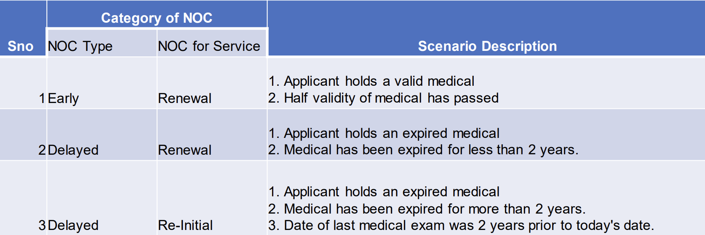

## CATEGORIES OF SPECIAL NOC

Understand the category for Special NOC , you need to apply via eGCA before proceeding with the application. To be selected specifically for special cases.

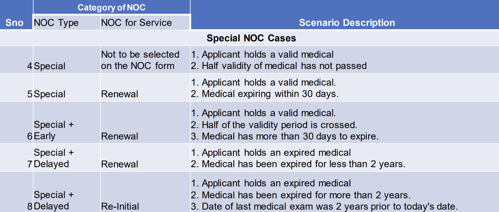

## Step-by-Step Guide for Applying

Now, let's go through the simple steps to apply for your Medical NOC on eGCA:

***Step 1***: Visit the eGCA portal at \[dgca.gov.in\](http://www.dgca.gov.in). Click on 'eGCA Login' located at the top right corner to access the login page. Provide your eGCA ID and Password, then click 'Submit'.

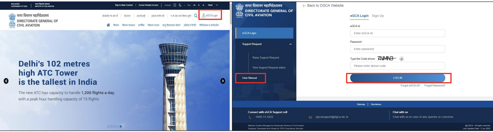

***Step 2***: Once you're logged in, find the 'Services' pane on the left of your dashboard. Click on 'Request for Medical NOC.' You can also type the service name into the search bar located on the top left and click to select it.

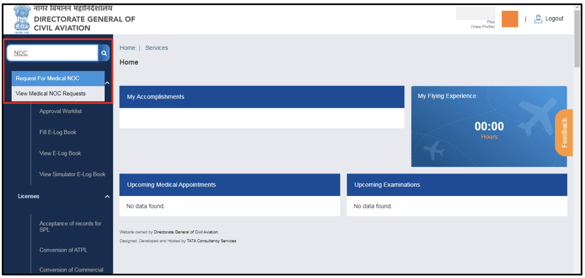

***Step 3***: In this step, you will select your Class of Medical. upload any necessary documents, and select the center/examiner for your examination. Once everything is ready, submit your application.

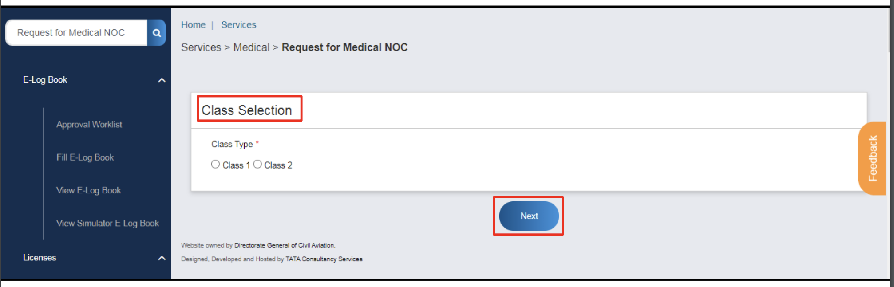

***Step 4***: Verify your basic details and personal details.

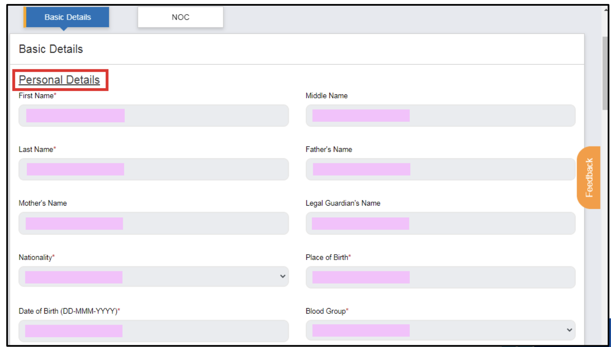

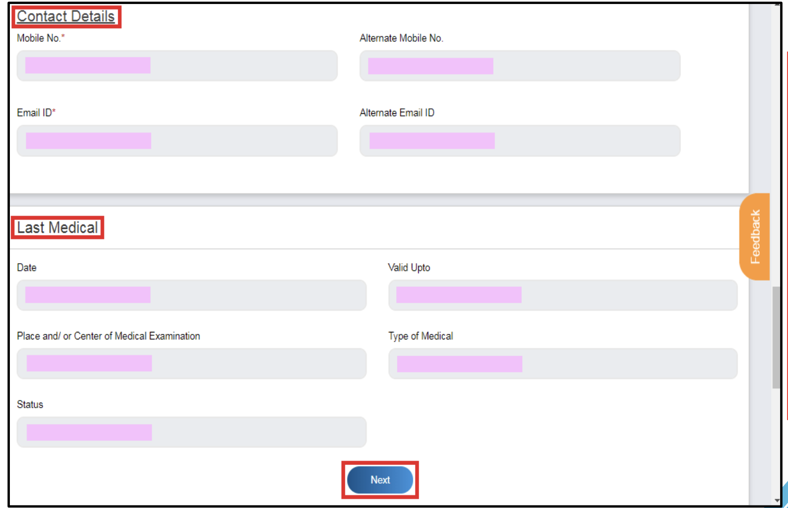

***Step 5***: Choose the NOC Type and Service, provide the reason for requesting the NOC.

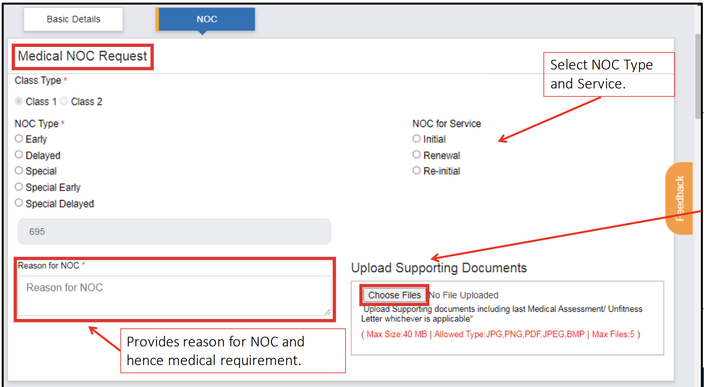

***Step 6***: After submission, you'll receive email and SMS notifications that include your eApplication ID. Medical Directorate Officers will be informed about your NOC application under the bell icon notification located at the top right of the dashboard.

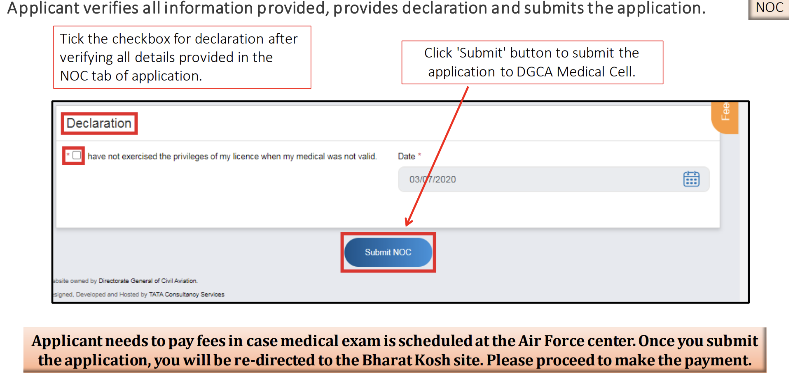

***Step 7***: Medical Directorate Officers will review your application. They may choose to approve, reject, or return it. You will be notified of their decision through SMS or email.

***Step 8***: To check the status of your application, click on 'View Medical NOC Requests' under Services on the left pane.

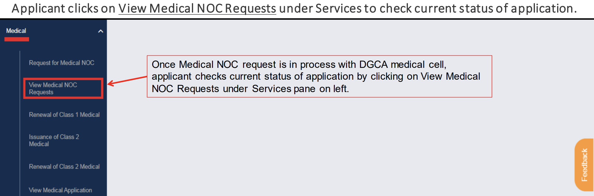

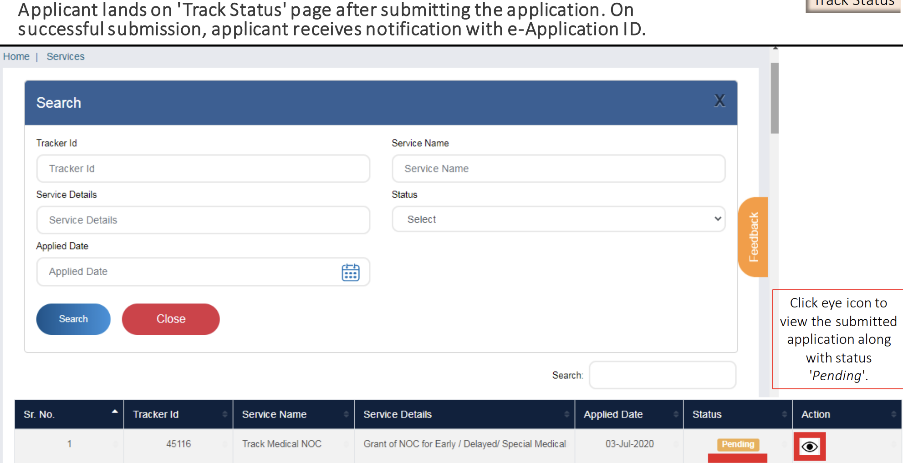

***Step 9***: You can view rejected or approved applications under the 'Other' radio button. Returned applications will appear under 'Pending' with the status 'Returned.'

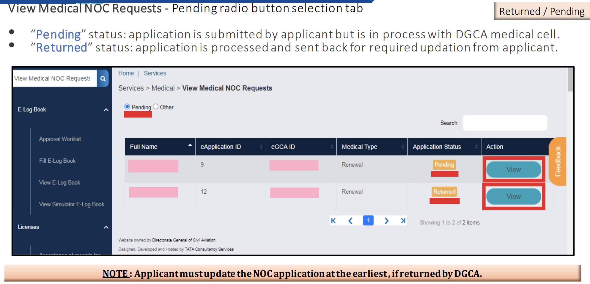

***Step 10***: If your application is returned, make the necessary updates by clicking the 'Update NOC details.' If approved, proceed by clicking the 'Continue' button.

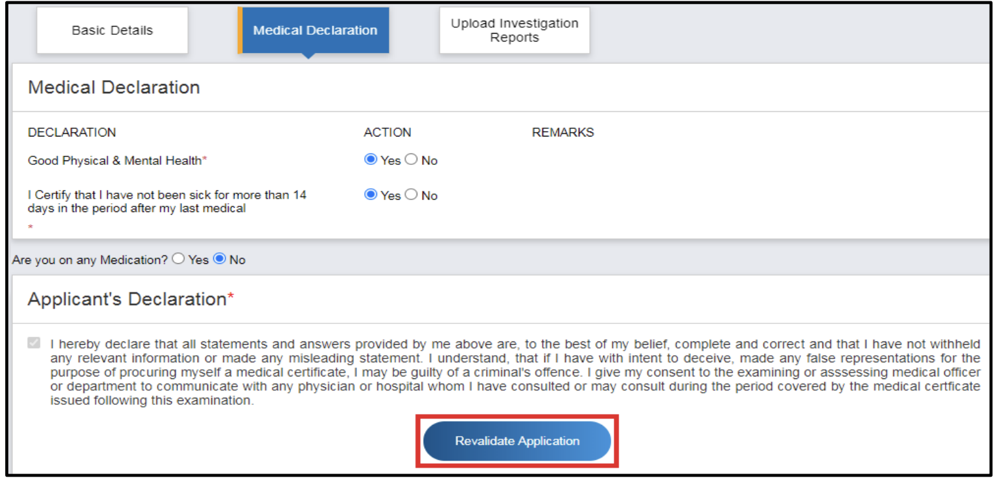

In conclusion, obtaining a Medical NOC on eGCA is a straightforward process that involves a few simple steps. Whether you need it due to a delayed medical renewal or want to get your examination done earlier, this guide will help you navigate the process with ease. So, don't wait – apply for your Medical NOC today and ensure your aviation career stays on course. If you found this guide helpful and are interested in learning more about pilot medical tests, we have several related blogs you might find useful:  

These blogs will provide you with additional information and insights into the various aspects of pilot medical examinations and the necessary documentation. Your journey in the aviation industry deserves all the support and guidance it can get, and we're here to help you every step of the way. Safe flying!
