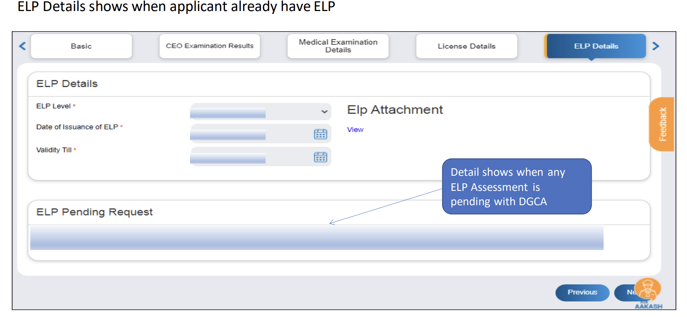

# Application of PPL(Private Pilot's License) : How to apply for PPL?

*Writer: Wingman Log | August 18, 2023 | 5 min read*

The dream of taking to the skies has always captivated the human spirit. Whether it's the thrill of piloting an aircraft or the desire to explore the world from a whole new perspective, the journey towards becoming a licensed pilot is both exciting and challenging. Thanks to the advancements in digital technology, the process of obtaining a Private Pilot License (PPL) has been streamlined and made more accessible through the eGCA portal. In this blog post, we'll walk you through the pre-requisites, step-by-step process, and the exhilarating experience of achieving your PPL.

## Pre-Requisites for Applying for a PPL

Before you embark on the journey to earn your wings, it's crucial to ensure you have all the necessary prerequisites:

1.  **eGCA Registration**: Begin by registering on the eGCA portal to obtain your unique eGCA ID, which will serve as your gateway to the aviation world.
    
2.  **Medical Fitness**: A valid Class II or Class I medical fitness certificate is essential to ensure you're physically capable of piloting an aircraft.
    
3.  **License and Examinations**: You should possess a valid Student Pilot License (SPL), Flight Radio Telephony Operator's License (FRTOL), or FRTOL(R). Additionally, you should have passed the English Language Proficiency (ELP) level 4 examination.
    
4.  **Knowledge Examinations**: Successful completion of various written examinations is required. These include tests on Air Regulations, Air Navigation, Aviation Meteorology, and Aircraft and Engines (Technical general and Specific). Depending on your preference, you can take these exams separately or as a combined paper.
    
5.  **e-Log Book and Flying Hours**: Maintain an updated e-Log book that records your flying hours and skill tests. Accumulated flying experience is crucial for progressing towards your PPL.

## The Step-by-Step Process

Now, let's break down the step-by-step process of applying for your PPL through the eGCA portal:

**Step 1: Log-In to eGCA Portal** Access the portal using your unique eGCA ID.

**Step 2: Select "Issuance of PPL"** Navigate to the "License" section and choose the "Issuance of PPL" service.

**Step 3: Understand Instructions** Carefully read and comprehend the instructions provided on the instruction page and user manual before proceeding.

**Step 4: Verify and Fill Application Form** Review and verify your basic details, CEO Examination Details, Medical Examination Details, License Details, ELP Details, and then complete the Issuance of PPL application form.

**Step 5: Rectify Discrepancies** If any discrepancies are found, correct them through the relevant channels.

**Step 6: Complete the Application Form** Fill out the application form for Issuance of PPL.

**Step 7: Select Aircraft Category** Specify whether you are applying for an airplane or helicopter category.

**Step 8: Defense Personnel Status** If you are an Indian Defense Personnel, provide the required documentation and details.

**Step 9: Rating Selection** Select the appropriate rating type (Aircraft Rating, Instrument Rating, Night Rating, or Extension of Aircraft Rating).

**Step 10: Flying Experience Details** Record your flying experience and qualifications corresponding to your chosen rating type.

**Step 11: Endorsement of Instrument Rating** If you are requesting an Instrument Rating, ensure you possess a valid FRTOL and Class 1 Medical.

**Step 12: Additional Aircraft Endorsement** For endorsement of additional aircraft, follow the relevant steps and provide necessary details.

**Step 13: ELP and Medical Certificates** Upload your ELP certificate and relevant medical certificates.

**Step 14: Flying Training Progress and Other Details** Submit relevant documents related to your flying training and other information.

**Step 15: Address and Checklist** Provide your preferred address to receive the physical copy of your license. Complete the checklist and upload any required documents.

## Bharatkosh Payment Gateway

**Step 16: Payment Process** Upon form submission, proceed to the Bharatkosh payment gateway to complete the fee payment.

**Step 17: Verify Details and Make Payment** Review your details, proceed with the fee payment, and verify the payment receipt.

**Step 18: Payment Receipt Generation** After successful payment, your payment receipt will be generated.

It's important to note that your application process is considered complete only upon a successful fee payment and receipt generation on the portal. The submission date to DGCA will be the date when the entire process, including payment, is finalized and received by the authorities.

Embarking on the journey to obtain your PPL is an adventure filled with challenges, growth, and the ultimate reward of achieving your pilot's license. The eGCA portal has revolutionized the application process, making it efficient, transparent, and accessible. As you progress through each step, keep your passion for flying alive and stay committed to fulfilling your dream of soaring through the skies. Remember, the skies are waiting for you, and with determination, dedication, and the right resources, you can make your aviation dreams a reality.

Refer to the pdf for more details.

Issuance of Private Pilot License.pdf

Download PDF • 2.30MB
