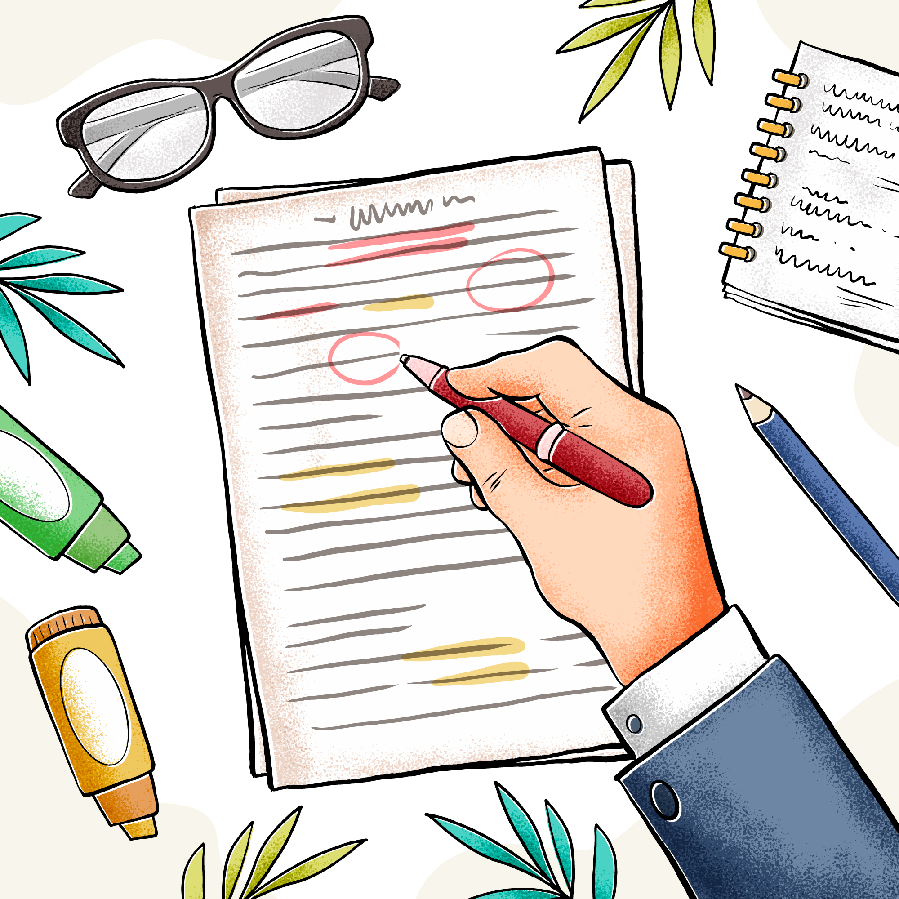
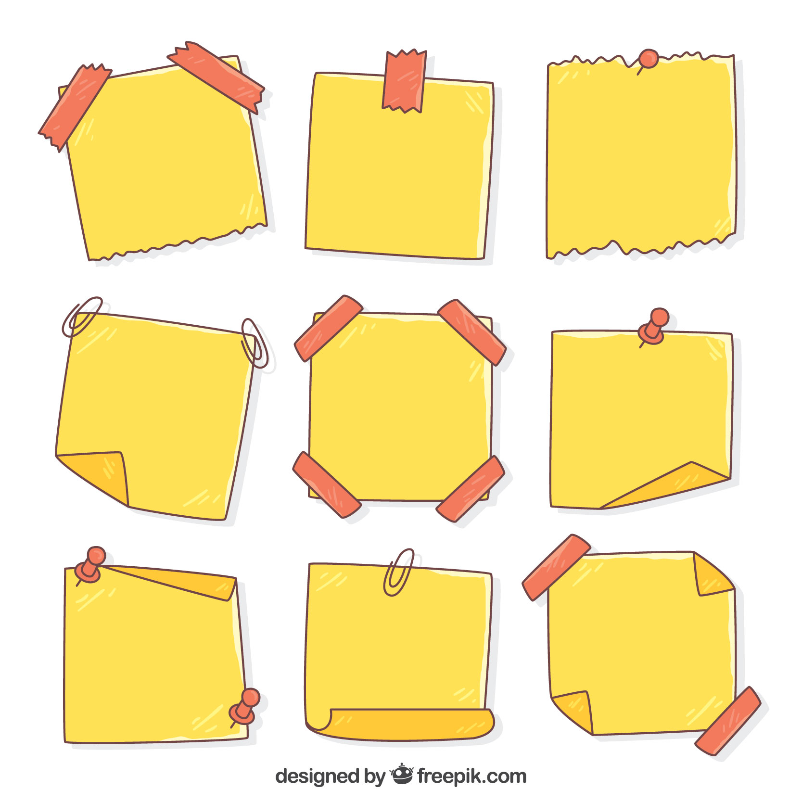

# How to prepare for Navigation exam : DGCA course for CPL

*Writer: Wingman Log | August 24, 2023 | 3 min read*

Hey there, future **aviators**! We know that becoming a **Commercial Pilot** is no small feat, and a crucial milestone on your journey is conquering the **DGCA Navigation exam** for your **Commercial Pilot License (CPL)**. Sounds like a lot, right? But fear not! We've got your back with some **awesome tips and strategies** to help you breeze through this challenge.

Your Study Buddy: A Structured Routine

Imagine tackling your favorite video game – you don't jump into the final boss battle without **mastering the levels**, right? Same goes for your exam prep. Set up a **daily routine** that divides your study time between **General Navigation, Radio, and Instruments**. Switching between topics keeps things fresh and prevents you from feeling like you're stuck in an endless loop.

## Study Materials that Speak Your Language

Say goodbye to confusing **techy talk**! While **Oxford materials** are good, consider grabbing **pilot books** for a **down-to-earth approach** to aviation theory. These books explain stuff in a way that makes sense even if you're new to aviation lingo. Plain and simple, just the way we like it!

## Syllabus 101: No Sweat

Before diving into your materials, give the **DGCA syllabus** a quick once-over. It's like checking out the **map before a road trip** – you know where you're headed. Stick to the **CPL stuff** and steer clear of the **ATPL detours**. Focus, my friend, focus!

##   

Get Your Game On: Practice, Practice, Practice

Remember **leveling up** in a video game? That's what **practice** does for your skills! Once you're done with your materials, it's **game time**. Get your hands on **Keith Williams' stuff** – it's like having a **cheat code for DGCA exams**. Tackle different question types, and you'll soon be the **master of problem-solving**.

## Extra Credit: Class Notes and Question Banks

You know those **extra side quests** in a game? **Class notes and question banks** are your exam side quests. They're like **hidden treasure chests** full of extra insights and alternate ways to tackle topics. Don't skip them – they can be your **secret weapons**!

##   

***Click on the link below to get all the study materials required to clear the DGCA CPL Navigation Exam***

Quick Summaries FTW

Say hello to your **Cliff's Notes for the exam** – "**Aviators Handbook**" by **Cmd Thomas Tom**. It's like having a **trusty sidekick** by your side, giving you quick recaps before your big adventure. Grab it online or from a cool bookstore, and you're all set for some **last-minute revision**.

##   

Keep That Determination Sky-High

You're on the path to greatness, my friend! Believe in yourself, keep your **determination soaring**, and remember that you've got what it takes to conquer this challenge. Picture yourself up there in the **skies**, and let that vision fuel your **motivation**.

So, there you have it – your guide to tackling the **DGCA Navigation exam** like a champ. With a **structured routine**, plain-speak study materials, loads of **practice**, and a dash of **motivation**, you'll be **soaring through that exam** in no time. You've got this, **future pilot**! Best of luck on your journey to becoming a skilled commercial pilot. **Fly high**! 🛫🌟
