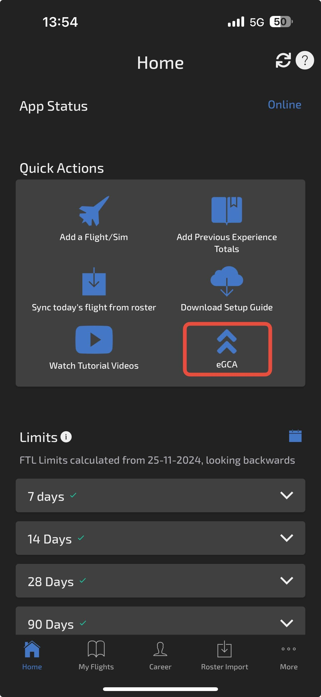
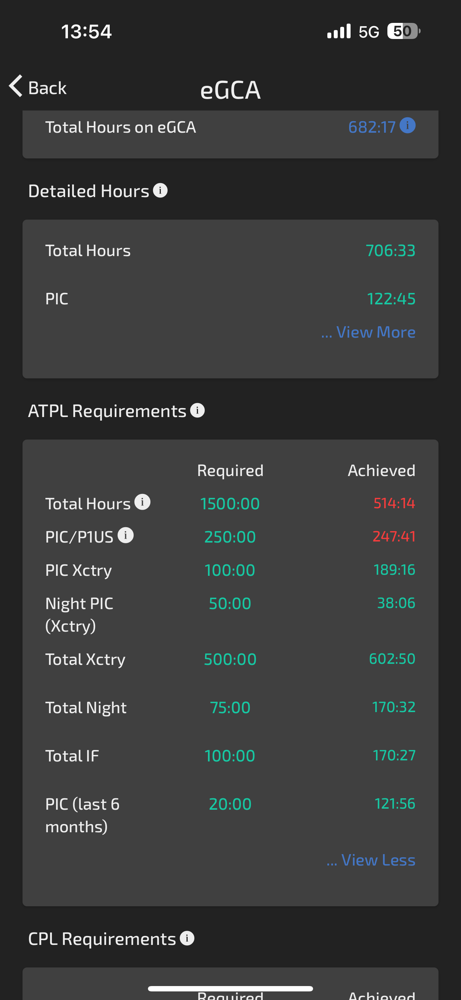
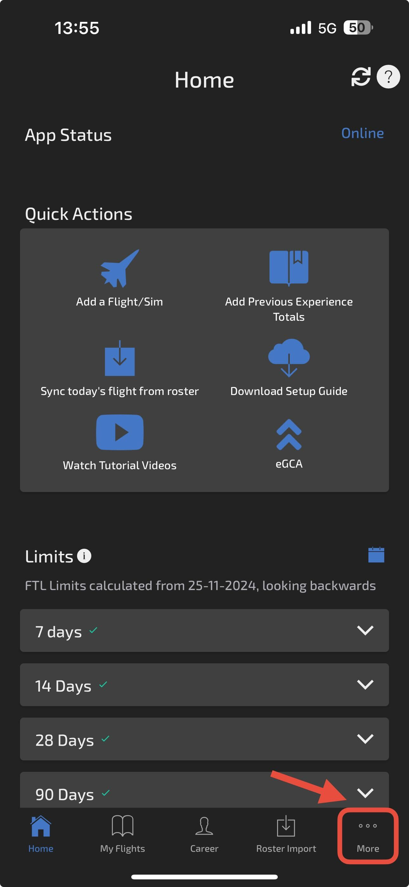
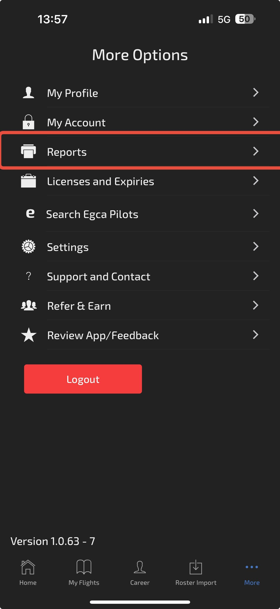
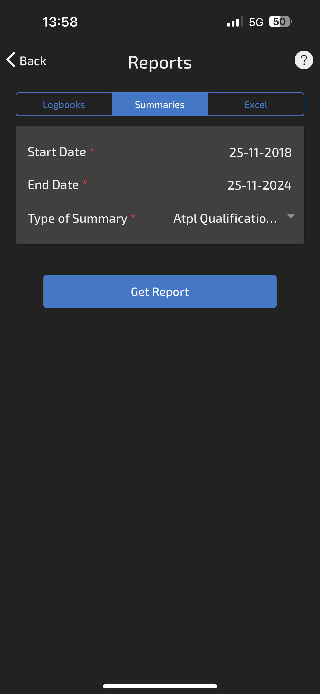
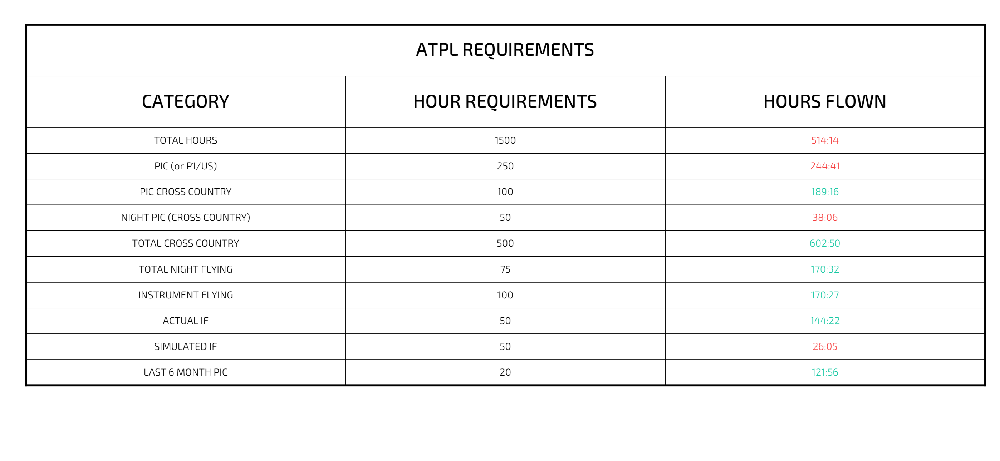

# How to Track ATPL Requirements with the Wingman App

*Writer: Wingman Log | November 25, 2024 | 3 min read*

For every pilot striving to meet DGCA’s stringent requirements for an ATPL (Airline Transport Pilot License), keeping track of flying hours is a challenge.

With various categories of hours—cross-country, night flying, PIC (Pilot-in-Command)—it’s easy to get overwhelmed. This task becomes even trickier with scattered flight records, incomplete data, or manual calculations.  

But here’s the good news: Whether your flight data is stored in eGCA or you use the Wingman app, [**Wingman’s**](https://onelink.to.wingman) **ATPL hour tracker** has you covered.

With just a few clicks, you can get a detailed breakdown of your [ATPL hour requirements](https://www.wingmanlog.in/post/atpl-hours-requirement-as-per-dgca)—no fuss, no errors.

Let’s dive into how you can do it!  

## ATPL Hour Tracker Using eGCA Data  

##   

If your flight data is uploaded to eGCA, Wingman integrates seamlessly to extract and display your ATPL requirements:  

1\. **Open the Wingman app**.  

2\. On the **homepage**, click on the **eGCA** option.

3\. Log in using your **eGCA credentials**.  

4\. That’s it! Wingman pulls your flight data directly from eGCA and presents a detailed summary of your ATPL hour requirements.  

It’s fast, accurate, and eliminates the need to manually cross-check eGCA records.  

## ATPL Hour Tracker Using Wingman Data 

For pilots who log their flight details directly in [Wingman](https://onelink.to.wingman), generating your ATPL report is just as simple:  

1\. Open the Wingman app.  

2\. Navigate to the **More** page.  

3\. Tap on **Report/Summary**.

4\. Select the **Summaries** option and input your flying period by entering the start and end dates.  

5\. From the dropdown menu, choose **ATPL Qualification Report**.  

6\. Voilà! You’ll have a detailed breakdown of your ATPL hour requirements in seconds.  

## Why Wingman is the Ultimate Tool for Pilots  

Keeping up with DGCA’s regulations doesn’t have to feel like a full-time job. Wingman simplifies your flight record management by:  

\- **Automating calculations** based on DGCA requirements.  

\- Offering both eGCA and manual entry options for flexibility.  

\- Providing error-free, instant reports that you can rely on.  

Whether you’re preparing for an ATPL application or just want to ensure you’re on the right track, Wingman takes the guesswork out of the process.  

## Start Tracking Your ATPL Hours Today  

##   

Pilots often spend countless hours manually calculating their flight data—don’t be one of them. With Wingman, tracking your ATPL requirements is no longer a tedious task. Download the app now and let Wingman do the heavy lifting while you focus on your next takeoff.  

Ready to take control of your flying hours? [**Wingman**](https://onelink.to/wingman) **is your co-pilot for success.**
