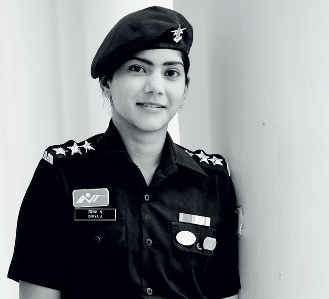

# Indian Pilots' International Achievements

*Writer: Wingman Log | July 29, 2023 | 4 min read*

In recent years, the world has witnessed a remarkable surge in the aviation industry, with pilots from various countries soaring to new heights in their careers. Among them, Indian pilots have been making their mark on the global stage with their outstanding achievements and contributions. Their skill, dedication, and determination have propelled them beyond borders, breaking barriers and showcasing the excellence of Indian aviation professionals to the world. In this article, we will explore some of the most remarkable international accomplishments of Indian pilots that have earned them accolades and admiration.

## 1\. Capt. Rakesh Sharma - The First Indian in Space

One of the earliest milestones in Indian aviation history was achieved on April 2, 1984, when Air Force Wing Commander Rakesh Sharma became the first Indian to travel to space. He was selected as a cosmonaut and flew aboard the Soviet spacecraft Soyuz T-11, spending seven days, 21 hours, and 40 minutes in space. During his mission, Capt. Sharma conducted various scientific experiments and brought pride to the nation with his successful space voyage.

## 2\. Capt. Divya Ajith Kumar - Youngest Woman to Fly Solo Around the World:  

In 2017, Capt. Divya Ajith Kumar, a young Indian pilot, etched her name in aviation history by becoming the youngest woman to circumnavigate the globe solo in a single-engine aircraft. At the age of 22, she embarked on her 37,000-kilometer journey, flying a light-sport aircraft across 22 countries. Her incredible feat not only showcased her exceptional flying skills but also inspired countless aspiring aviators, especially young women, to pursue their dreams fearlessly.

## 3\. Capt. Amol Yadav - Building Indigenous Aircraft

Capt. Amol Yadav, an Indian commercial pilot, harbored a dream of developing an indigenous aircraft for India. His relentless pursuit of this dream led to the creation of the "Sarang" aircraft, a six-seater plane made almost entirely from scratch in his backyard. This home-built aircraft caught the attention of aviation enthusiasts worldwide and earned accolades for its innovation. Capt. Yadav's dedication to advancing India's aerospace capabilities serves as a testament to the ingenuity of Indian pilots.

## 4\. Capt. Zoya Agarwal - Leading All-Women Crew on Long-Haul Flight:

In a significant step towards gender equality and empowerment, Capt. Zoya Agarwal made history in 2021 by leading an all-women crew on a long-haul flight. The Air India Boeing 777 flew from San Francisco to Bengaluru, covering a distance of over 16,000 kilometers. Capt. Agarwal's pioneering role as the commander of this ultra-long-haul flight shattered stereotypes and highlighted the potential of women in the aviation industry.

## 5\. Wing Commander Anjali Singh - India's First Female Military Pilot to Serve on UN Mission

Wing Commander Anjali Singh created history by becoming the first female military pilot from India to serve on a United Nations peacekeeping mission. Her appointment as a helicopter pilot with the United Nations Mission in South Sudan (UNMISS) showcased India's commitment to global peace efforts. It also demonstrated the Indian Air Force's dedication to gender inclusivity and the role of women in serving on international missions.

**Conclusion**

The achievements of Indian pilots on the international stage have not only made the nation proud but have also contributed significantly to the global aviation industry. From conquering space to leading groundbreaking missions, these pilots have proven their mettle beyond borders and opened doors for future generations of aviators. Their determination, talent, and passion for aviation serve as an inspiration to all, emphasizing the power of dreams and the potential of human achievement. As India continues to produce exceptional aviation professionals, the world eagerly awaits to witness even more remarkable accomplishments from these intrepid pilots in the years to come.
