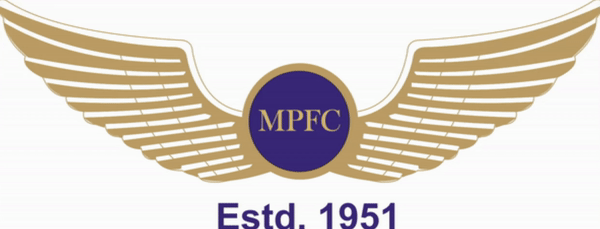
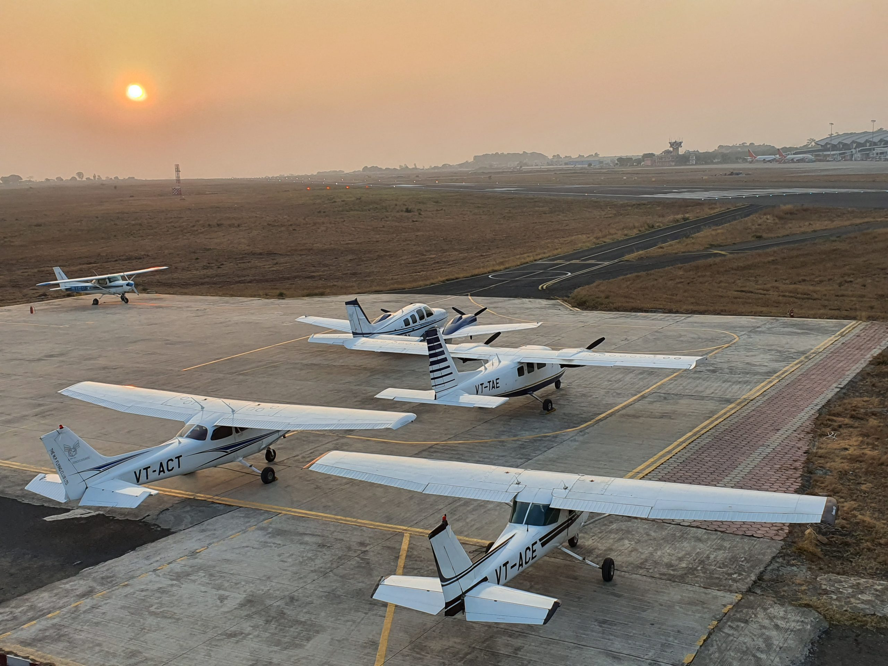

# Madhya Pradesh Flying Club: Fees, Fleet, Operating Base, and More

*Writer: Wingman Log | September 7, 2023 | 3 min read*

The Madhya Pradesh Flying Club (MPFC) is a renowned institution in the field of aviation, offering a range of flying courses and services to aviation enthusiasts, aspiring pilots, and professionals. In this article, we will delve into various aspects of the Madhya Pradesh Flying Club, including its fees, fleet, operating base, and more.

## History and Overview

The Madhya Pradesh Flying Club was established in 1951 and has since been a prominent name in the aviation sector. It is located in Bhopal, the capital city of Madhya Pradesh, and has played a pivotal role in training numerous pilots and contributing to the growth of aviation in the region.

##   

Operating Base

Madhya Pradesh Flying Club operates primarily from its base at Raja Bhoj Airport, also known as Bhopal Airport and also at Indore airport. This strategically located airports provides students with access to a controlled environment that mirrors real-world aviation operations. The airport's facilities include runways, taxiways, air traffic control, and maintenance services, ensuring a comprehensive training experience.

## Courses Offered

MPFC offers a wide range of courses catering to individuals at different stages of their aviation journey. These courses include:

***a. Private Pilot License (PPL):*** This course is designed for beginners and covers the fundamentals of flying.

***b. Commercial Pilot License (CPL):*** Aspiring commercial pilots can pursue this course, which prepares them for a career in aviation.

***c. Instrument Rating:*** For those seeking advanced training in instrument flying, MPFC offers an Instrument Rating course.

***d. Multi-Engine Rating:*** This course focuses on flying multi-engine aircraft and is ideal for pilots looking to expand their skill set.

***e. Flight Instructor Rating (FIR)***: Aspiring flight instructors can obtain their certification through this program.

## Fees Structure

Understanding the cost structure is crucial for anyone considering training or utilizing MPFC's services. The fees at Madhya Pradesh Flying Club may vary depending on the specific program or service chosen. It is around 30-35 lakh rupees for CPL course. Factors influencing the fees include the type of aircraft used, the duration of training, and additional services such as ground school. Prospective students are advised to contact MPFC directly or visit their official website for the most current fee information.

## Fleet  

Cessna 152: A popular choice for basic flight training, the Cessna 152 is a two-seat, single-engine aircraft known for its reliability and ease of handling.

Cessna 172: The Cessna 172 is a four-seat, single-engine aircraft frequently used for more advanced flight training and cross-country flying.

P68 : For multi-engine training, MPFC might have aircraft like the p68, known for its modern avionics and advanced features.

## Infrastructure and Facilities

Apart from its fleet and training facilities, MPFC offers a host of amenities and resources for students and aviation enthusiasts. These may include:

a. Classroom and briefing rooms for theoretical training.

b. A well-equipped simulator for flight training.

c. Hangar space for aircraft maintenance and storage.

d. Library and study materials.

e. Experienced and certified flight instructors.

The Madhya Pradesh Flying Club stands as a testament to the growth and development of aviation in the state of Madhya Pradesh. With a rich history, a comprehensive range of courses, a diverse fleet, and a strategic operating base, MPFC continues to be a top choice for those aspiring to take to the skies. Whether you dream of becoming a private pilot or pursuing a career in commercial aviation, MPFC provides the tools and training needed to soar to new heights in the world of aviation.
